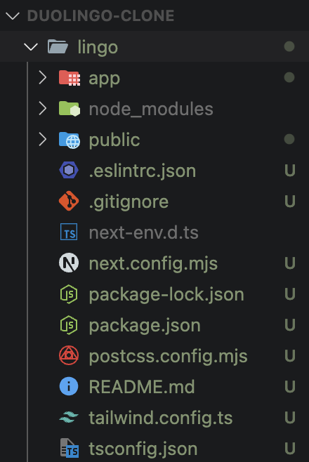
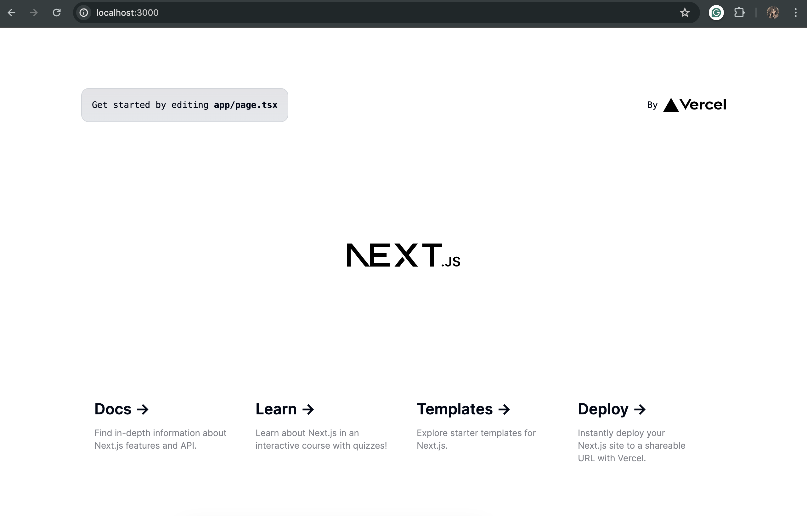
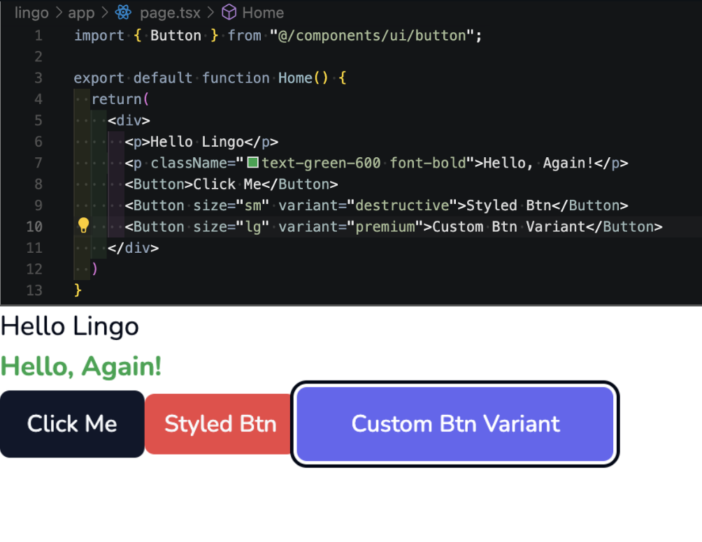

# 01 Project Setup

## Installations

1. To configure this Next.js application, start by ensuring the necessary system requirements as specified per the [Nextjs Documentation](https://nextjs.org/docs/getting-started/installation).

2. Next, access the terminal and check the system's current node version using the command `node -v`. As of this project, the node version is currently at v21.4.0.

3. After confirming the necessary system requirements, run the following command to perform automatic installations: `npx create-next-app@latest`. If a message in the terminal pops up that a nextjs package needs to be installed, select "yes" and wait be prompted to title this project (in this case: **_lingo_**). Afterwards, select yes or no for the following dependencies: 
    * TypeScript? **Yes**
    * ESLinkt? **Yes**
    * Tailwind Css? **Yes**
    * `src/` directory? **No**
    * App Router? **Yes**
    * Import alias? **No**

    Wait for the dependencies to install and ensure a "Success!" message shows up in the terminal. A project folder with the name we inputted for our app will show up in the project manager. The project folder will contain subdirectories named `app`, `node_modules`, and `public`, as well as some configuration files like `tsconfig.ts`, `tailwind.config.ts`, and `postcss.config.ts`. As for what these files do they are (1) used for managing TypeScript, (2) Tailwind CSS styling, and (3) enable Tailwind CSS, respectively.
    <div align="center">
    
    </div>

### What's in each directory of the Nextjs App's folder (`lingo/`)?

4. Before working in the project, use a component library called **[shadcn/ui](https://ui.shadcn.com/docs/installation/next)**. , which is not to be installed as a dependency but only as specific components are needed. To install the package, go inside the project's folder and run the command `npx shadcn-ui@latest init`.
    - When prompted, select **Default** for style, **Slate** for base color, and **yes** for CSS variables.
    
    After successful installation, run the command `npm run dev` to start up the project. 

    <div align="center">
    
    </div>

### Changing the App's Font
5. To change the font for the whole project, access the **`layout.tsx`** file of the `app/` directory. Google's "Inter" font is set up by default but can be changed by importing the desired font, such as "Nunito," and its respective variable.
    ```tsx
    import { Nunito } from "next/font/google";
    const font = Nunito({ subsets: ["latin"] });
    
    // ...
    <body className={font.className}>{children}</body>
    ```

### Setting Up the Canvas

6. The page needs to be cleared up so we have a blank slate to work on. The page's code can be accessed in the **`page.tsx`** file in the same `app/` directory and can be completely removed. 
    ```tsx
    export default function Home() {
        return(
            <div>
                <p>Hello Lingo</p>
            </div>
        )
    }
    ```

7. This step would serve as a good checkpoint to verify that Tailwind CSS is properly configured. See how to enhance styling experience by checking the extensions in **[extensions.md](./extensions.md)**.

### Adding a Button Component

8. To add a button component to the project, ensure that we're still in the project `lingo/`'s directory and install this component by typing the following in a separate terminal: 
    ```
    npx shadcn-ui@latest add button
    ```
    
    This will create a `components/ui` folder containing the component file `button.tsx`.

9. To use this button, navigate back to the `page.tsx` file and import the new button component:
    ```tsx
    <Button>Click Me</Button>
    ```
    
    These styles are in the component in the form of sizes, variants, etc. from the Tailwind CSS library which can then be translated as props for us to use in the main `page.tsx` file. These variants within the `button.tsx` can also be removed, added, and altered as needed.
    <div align="center">
    
    </div>

