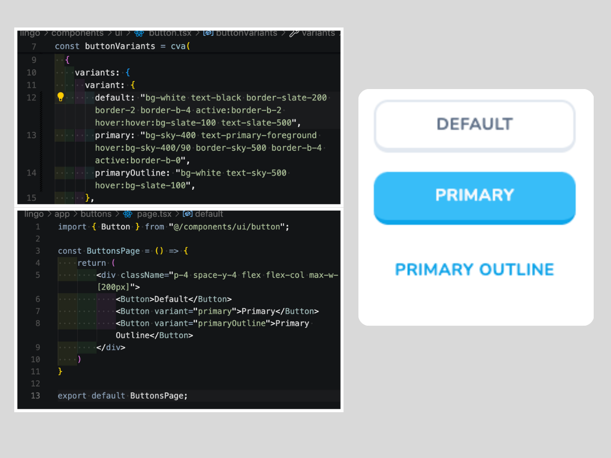

# 02 Building a Button Component Library

**Overview:** Establishing routes and creating the button component library lays the foundation for our application's structure and ensures seamless navigation and component usage throughout the project.

### Setting Up Routes in Next.js

To establish routes within a Next.js application, we utilize the `app/` directory. Within this directory, we create a folder named after the desired URL, such as "buttons". Each route requires a file named `page.tsx`. 

```md
FILE STRUCTURE
lingo/
|__app/
    |__buttons/
        |__page.tsx
    |__page.tsx
```

Leaving the `page.tsx` file empty in the "buttons" route folder will result in an "Unhandled Runtime Error". To resolve this, we must export a default component from `buttons/page.tsx`.

```tsx
const ButtonsPage = () => {
    return (
        <div>
            <h2>Buttons Page</h2>
        </div>
    )
}
export default ButtonsPage;
```

It's important to note that changing the filename to anything other than `page.tsx` will result in a 404 Error Page.

#### Disclaimer:
Such incidents may lead to the auto-creation of temporary files in the **.next/** directory. These files, although unusual, are cache-related and do not impact the project.

### Creating the Buttons Library

Now, we proceed to craft the buttons needed for the application. Within the **button.tsx** file, we can customize baseline configurations and variants. 

For the buttons library, we'll adjust configurations and remove (and recreate) all variants. The default button will feature a clean, plain appearance with `hover` and `active` styling.

<div align="center">

</div>

Default buttons, those without any parameters, are automatically set to the "**default**" variant in the **button.tsx** file, unless otherwise specified. See [localhost:3000/buttons](#) for Button Library.
