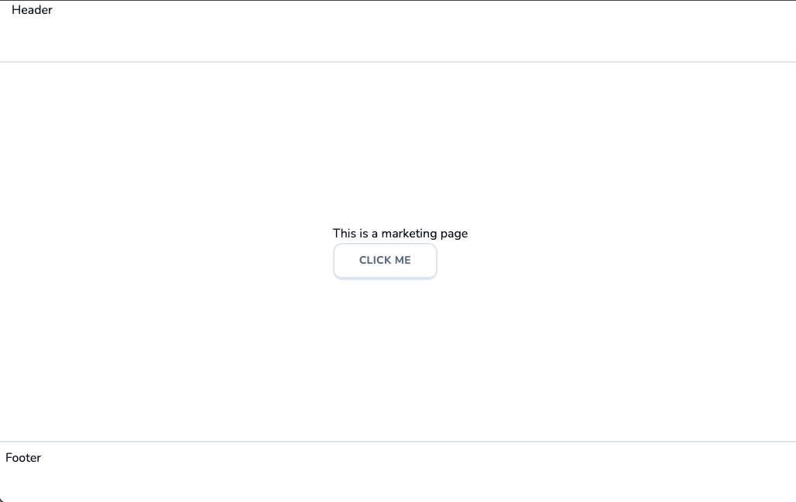

# 03 Marketing Skeleton

**Overview:** This section focuses on preparing the marketing or landing page. We'll focus on route groups and how to reuse layout components.

## Route Groups

### What are Route Groups?

**Route groups** are folders that can still be used to render routes by utilizing the "reserved" `page.tsx`, but with the difference of wrapping them in parentheses, indicating that the folder will not be part of the URL. This makes it useful for organizing routes.

This is particularly useful when creating a folder solely for organizational purposes, which would never be named for a URL. In this case, the `page.tsx` can be relocated from the `app/` folder to the newly created `(marketing)/` folder. This change will maintain the root route: "/".

```
lingo/
|__app/
    |__(marketing)/
    |__layout.tsx
    |__page.tsx
```

This approach is also beneficial for creating a `layout.tsx` file, similar to page files, with a default export inside.

```tsx
type Props = {
    children: React.ReactNode;
};

const MarketingLayout = ({children}: Props) => {
    return (
        <div className="min-h-screen flex flex-col">
            <main className="flex-1 flex flex-col items-center justify-center">
                {children}
            </main>
        </div>
    )
}
export default MarketingLayout;
```

With this `layout.tsx`, we define a reusable layout that wraps any children within it. Therefore, everything (route folders and the like) within the `(marketing)/` folder will follow this layout.

<div align="center">

</div>

### Creating the Header and Footer

Now, we create the `header.tsx` file within the `(marketing)/` folder. This will be made as its own file and not a page within a route folder because it's a reusable component that will appear within different routes of this section, utilizing named exports.

#### layout.tsx

```tsx
import { Footer } from "./footer";
import { Header } from "./header";

type Props = {
    children: React.ReactNode;
};

const MarketingLayout = ({children}: Props) => {
    return (
        <div className="min-h-screen flex flex-col">
            <Header />
            <main className="flex-1 flex flex-col items-center justify-center">
                {children}
            </main>
            <Footer />
        </div>
    )
}
export default MarketingLayout;
```

#### header.tsx
```tsx
export const Header = () => {
    return (
        <header className="h-20 w-full border-b-2 border-slate-200 px-4">
            Header
        </header>
    )
}
```

#### footer.tsx
```tsx
export const Footer = () => {
    return (
        <footer className="hidden lg:block h-20 w-full border-t-2 border-slate-200 p-2">
            Footer
        </footer>
    )
}
```

In other words, this "header" and "footer" will not disappear when the children re-renders itself. The footer will only disappear as styled for when the screen size is in mobile form.

<div align="center">

</div>