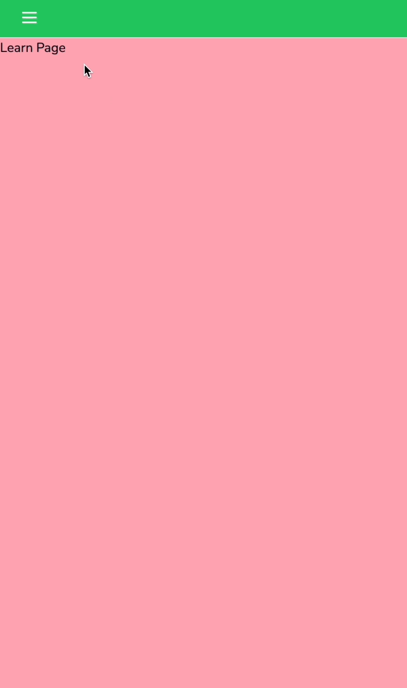
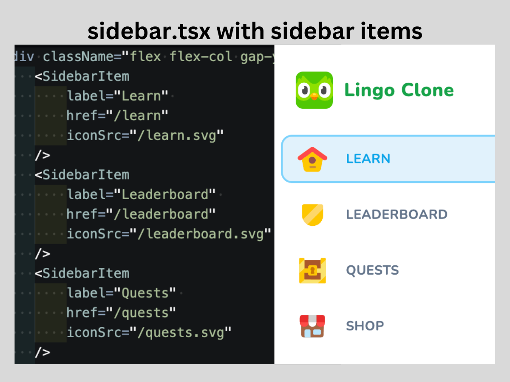

# 06 Main Layout

Similar to the `(marketing)/` directory, a new route group called **`(main)/`** houses the page and layout of the learn platform. As per standard, this directory contains a `layout.tsx` file and a route folder called **`learn/`**, which includes a **`page.tsx`** file to render this route.

#### `(main)/layout.tsx`

```tsx
type Props = {
    children: React.ReactNode;
};

const MainLayout = ({
    children,
}: Props) => {
    return (
        <div>
            {children}
        </div>
    );
};

export default MainLayout;
```

#### `(main)/learn/page.tsx`

```tsx
const LearnPage = () => {
    return (
        <div>
            Learn Page
        </div>
    );
}

export default LearnPage;
```

Now that these files are set up, there should no longer be errors on the webpage when it redirects to "/learn" after authentication. The **`(main)/layout.tsx`** file serves as a fragment where the `{children}` are wrapped in a main element.

## The Sidebar Component

Since the sidebar needs to be accessible regardless of whether the webpage is for desktop or mobile layout, it's created as a reusable component under `lingo/components/`. This is distinct from the `ui/` folder, which stores components created by shadcn.

After adding the sidebar, it may push the main component down. To address this, we give the sidebar a fixed position so it stays in place when the user scrolls down the page. We don't want the sidebar to be scrollable; it should only hide or collapse in a drawer when in mobile view and be visible on desktop.

#### `components/sidebar.tsx`

```tsx
import { cn } from "@/lib/utils";

type Props = {
    className?: string;
}

export const Sidebar = ({ className }: Props) => {
    return (
        <div className={cn(
            "flex bg-blue-400 h-full lg:w-[256px] lg:fixed left-0 top-0 px-4 border-r-2 flex-col", 
            className
        )}>
            Sidebar
        </div>
    )
}
```

We add an optional prop of `className` that can be passed from the outside, allowing flexible styling. In the **`layout.tsx`**, we hide this component for mobile devices with `<Sidebar className="hidden lg:flex" />`, making it visible only on desktop.

To enable mobile users to trigger the sidebar, we add padding to the top of the learn page. This pushes the page down to accommodate a header menu on mobile but disappears on desktop view.

## Building the Mobile Header

The **mobile-header** component serves as the trigger for opening the sidebar on mobile devices. When clicked, it activates the **mobile-sidebar** component, providing access to the same navigation links and content as the desktop sidebar.

#### `components/mobile-header.tsx`

```tsx
import { MobileSidebar } from "./mobile-sidebar"

export const MobileHeader = () => {
    return (
        <nav className={/* ... */}>
            <MobileSidebar />
        </nav>
    )
}
```

## Building the Mobile Sidebar

The **mobile-sidebar** component utilizes a _shadcn_ "sheet" component to create a drawer-like interface that slides open when triggered by the mobile header. It contains the same navigation links and content as the desktop sidebar but is optimized for smaller screens.

```bash
npx shadcn-ui@latest add sheet
```

This command installs a new shadcn component in the directory `components/ui/`. We create the `<MobileSidebar />` component using this package:

```tsx
import { Menu } from "lucide-react";

import {
    Sheet,
    SheetContent,
    SheetTrigger
} from "@/components/ui/sheet";
import { Sidebar } from "@/components/sidebar";

export const MobileSidebar = () => {
    return (
        <Sheet>
            <SheetTrigger>
                <Menu className="text-white" />
            </SheetTrigger>
            <SheetContent className="p-0 z-[100]" side="left">
                <Sidebar />
            </SheetContent>
        </Sheet>
    )
}
```

After rendering this component in **mobile-header**, a "hamburger-styled" menu appears. Clicking it slides open a drawer with the sidebar content. This `<MobileSidebar />` can be customized to open to the left of the screen instead of the default right orientation.

<div align="center">

</div>

## Refining the Sidebar Component

We start by copying the div containing the logo and title of our app into the sidebar component, wrapping it with a `<Link>` tag.

We then create and import a new component called **sidebar-item**. This reusable component utilizes `"use client"` to create hooks, add `onClick`, and manage state. This ensures that it functions as a client component, enabling dynamic behavior.

### `<SidebarItem />` Component

This file defines the sidebar item component. It represents individual items within the sidebar navigation menu, such as links to different sections of the application. It includes functionality to highlight the active item and handle navigation when clicked.

```tsx
"use client";

import Link from "next/link";
import { usePathname } from "next/navigation";

import { Button } from "./ui/button";
import Image from "next/image";

type Props = {
    label: string;
    iconSrc: string;
    href: string;
};

export const SidebarItem = ({
    label,
    iconSrc,
    href
}: Props) => {
    const pathName = usePathname();
    const active = pathName === href;
    
    return (
        <Button
            variant={active ? "sidebarOutline" : "sidebar"}
            className="justify-start h-[52px]"
            asChild
        >
            <Link href={href}>
                <Image
                    src={iconSrc}
                    alt={label}
                    className="mr-5"
                    height={32}
                    width={32}
                />
                {label}
            </Link>
        </Button>
    );
};
```

<div align="center">

</div>

Finally, we add a logout button that utilizes Clerk imports from the marketing page in **sidebar.tsx**.

```tsx
import { ClerkLoading, ClerkLoaded, UserButton } from "@clerk/nextjs";
import { Loader } from "lucide-react";
//... other imports and code omitted for brevity

export const Sidebar = () => {
    return (
        <div className={...}>
            {/* ... */}
            <div className="p-4">
                <ClerkLoading>
                    <Loader className="h-5 text-muted-foreground animate-spin" />
                </ClerkLoading>
                <ClerkLoaded>
                    <UserButton afterSignOutUrl="/" />
                </ClerkLoaded>
            </div>
        </div>
    )}
```
