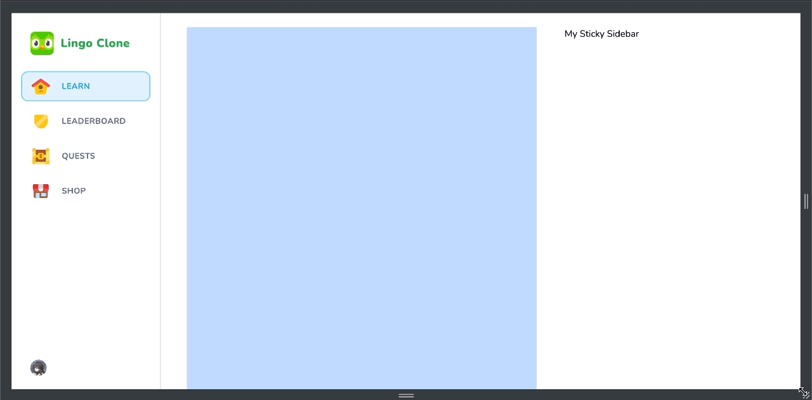
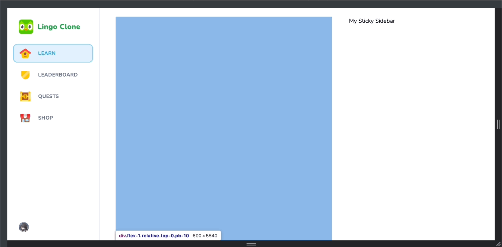
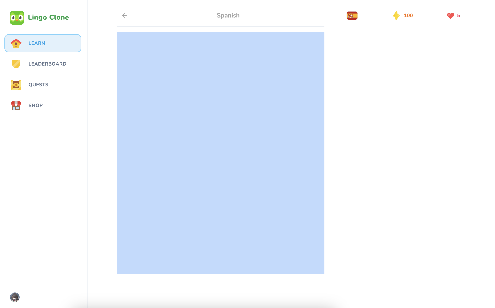

# 07 Learn Page Wrappers

In this section of the project, we'll enhance the **layout.tsx** file in the `main/` directory to optimize the main layout for the learn platform.

## Table of Contents:

- [First Component: Sticky Wrapper](#1-first-component-sticky-wrapper)
- [Editing the Learn Page](#editing-the-learn-page)
- [Second Component: The Feed Wrapper](#2-second-component-the-feed-wrapper)
- [Third Component: Learn Page's Header](#3-third-component-learn-pages-header)
- [Fourth Component: User Progress](#4-fourth-component-user-progress)
- [Summary](#summary)

---

Initially, we maximize the breakpoint of the main layout to accommodate larger screens:

### `(main)/layout.tsx`

This defines the overall structure of the learn platform's layout, including the sidebar, mobile header, and main content area. Maximizes the breakpoint for larger screens to optimize viewing.

```tsx
import { Sidebar } from "@/components/sidebar";
import { MobileHeader } from "@/components/mobile-header";

type Props = {
    children: React.ReactNode;
};

const MainLayout = ({
    children,
}: Props) => {
    return (
        <>
            <Sidebar className="hidden lg:flex" />
            <MobileHeader />
            <main className="lg:pl-[256px] h-full pt-[50px] lg:pt-0">
                <div className="max-w-[1056px] mx-auto pt-6 h-full">
                    {children}
                </div>
            </main>
        </>
    );
};

export default MainLayout;
```

<div align="center">

</div>


### 1. First Component: Sticky Wrapper

Next, we directly edit the page file of the learn route, beginning with defining some classes. For the learn page, we create a reusable **sticky-wrapper** component to hold the user's records and other progress information, ensuring it remains fixed as the user scrolls throughout the page.

#### `components/sticky-wrapper.tsx`

```tsx
type Props = {
    children: React.ReactNode; 
};

export const StickyWrapper = ({ children }: Props) => {
    return (
        <div className="hidden lg:block w-[360px] sticky self-end bottom-6">
            <div className="min-h-[calc(100vh-48px)] sticky top-6 flex flex-col gap-y-4">
                {children}
            </div>
        </div>
    )
}
```


## Editing the Learn Page

Utilizes various wrapper components to structure the content of the learn page, ensuring a smooth user experience. The **sticky-wrapper** and **feed-wrapper** components are employed to manage the positioning and scrolling behavior of different elements on the page.

#### `(main)/learn/page.tsx`

```tsx
import { StickyWrapper } from "@/components/sticky-wrapper";
import { UserProgress } from "@/components/user-progress";
import { FeedWrapper } from "@/components/feed-wrapper";

const LearnPage = () => {
    return (
        <div className="flex flex-row-reverse gap-[48px] px-6">
            <StickyWrapper>
                <UserProgress
                    activeCourse={{ title: "Spanish", imageSrc: "/es-flag.svg" }}
                    hearts={5}
                    points={100}
                    hasActiveSubscription={false}
                />
            </StickyWrapper>
            <FeedWrapper>
                {/* Content */}
            </FeedWrapper>
        </div>
    );
}

export default LearnPage;
```

<div align="center">

</div>


### 2. Second Component: The Feed Wrapper

The **feed-wrapper** component is scrollable and holds the content of the language course. It allows the user to navigate through the course content smoothly.

#### `components/feed-wrapper.tsx`

```tsx
type Props = {
    children: React.ReactNode;
};

export const FeedWrapper = ({
    children
}: Props) => {
    return (
        <div className="flex-1 relative top-0 pb-10">
            {children}
        </div>
    )
}
```

### 3. Third Component: Learn Page's Header

The **header** component, located within the learn route folder, is responsible for displaying the header of the learn page. It contains navigation elements and provides context to the user and remains fixed at the top of the screen for easy access.

#### `(main)/learn/header.tsx`

```tsx
type Props = {
    title: string;
};

export const Header = ({ title }: Props) => {
    return (
        <div className="sticky top-0 bg-white pb-3 lg:pt-[28px] flex items-center justify-between border-b-2 mb-5 text-neutral-400 lg:z-50">
            {/* Header Content */}
        </div>
    )
}
```

### 4. Fourth Component: User Progress

The **user-progress** component displays the user's progress within a course, including points, hearts, and active subscriptions. It provides feedback and motivation to the user.

#### `components/user-progress.tsx`

```tsx
import Link from "next/link";
import Image from "next/image";

import { Button } from "@/components/ui/button";
import { InfinityIcon } from "lucide-react";

type Props = {
    activeCourse: { imageSrc: string; title: string}; // TODO: Replace with DB Types
    hearts: number;
    points: number;
    hasActiveSubscription: boolean;
}
export const UserProgress = ({ 
    activeCourse, 
    points, 
    hearts, 
    hasActiveSubscription
}: Props) => {
    return (
        <div className="flex items-center justify-between gap-x-2 w-full">
            {/* User Progress Content */}
        </div>
    );
};
```

<div align="center">

</div>

## Summary

In this section of the project, significant enhancements have been made to optimize the learn platform's layout and user experience. The **layout.tsx** file in the `main/` directory was updated to maximize the breakpoint for larger screens, ensuring better usability. Additionally, various reusable components were introduced, including the **sticky-wrapper**, **feed-wrapper**, **header**, and **user-progress** components, which collectively contribute to a more organized and engaging learn page. These components play crucial roles in structuring the content, providing feedback on user progress, and ensuring smooth navigation through language courses. With these improvements, the learn platform is now better equipped to deliver an enhanced learning experience to users.