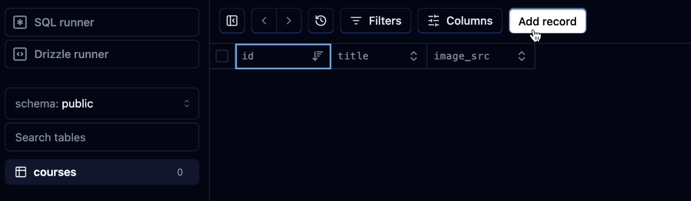

# Setting up the Database with Drizzle and Neon

For this chapter, we are going to set up the database with Neon using Drizzle ORM.

## Table of Contents

- [What is Neon?](#what-is-neon)
- [What is Drizzle?](#what-is-drizzle)
- [Creating and Connecting a New Database with Neon](#creating-and-connecting-a-new-database-with-neon)
    - [Setting Up Drizzle](#setting-up-drizzle)
- [Setting up the Database Directory](#setting-up-the-database-directory)
    - [Drizzle Configuration](#drizzle-configuration)
- [Running the DB](#running-the-db)

## What is Neon?

Neon is a cloud-native database built for modern applications. It offers features like scalability, reliability, and ease of use, making it an ideal choice for projects requiring robust database solutions.

## What is Drizzle?

Drizzle is an Object-Relational Mapping (ORM) tool designed to simplify database interactions in JavaScript applications. It provides a seamless way to connect and interact with databases, abstracting away much of the complexity involved in database management.

## Creating and Connecting a New Database with Neon

We will first head to the [Neon](https://neon.tech/) website. After signing in to an account, The "Create Project" page will show up. We'll title it with the name of our project, **lingo-clone**, and the same name will also be given to the "Database Name". Select the appropriate timezone and click on "Create Project".

A connection string should then be prompted under "**Postgres**". Click the "eye" symbol to reveal, then copy it. This string will be stored with our environment keys in the `.env` file of our project folder. The way it will be saved is as follows:

```.env
NEXT_PUBLIC_CLERK_PUBLISHABLE_KEY=********
CLERK_SECRET_KEY=******

DATABASE_URL="******"
```

And that's pretty much it for setting up Neon for our database. However, we still need the dashboard open so we can later confirm that records are added to the database successfully.

### Setting Up Drizzle

Go to the Drizzle documentation for [Getting Started with Neon](https://orm.drizzle.team/docs/get-started-postgresql#neon) for PostgreSQL.

Shut down the server for our app and in that very terminal enter this command to install Drizzle ORM:

```bash
npm i drizzle-orm @neondatabase/serverless
```

** Due to some issues installing Drizzle ORM with conflicting dependencies, the following command was used instead:

```bash
npm i drizzle-orm @neondatabase/serverless --legacy-peer-deps
```

This next command will be installed as well but inside of our dev dependencies as it's not going to be used for production purposes:

```bash
npm i -D drizzle-kit
```

Now that that's done, let's add some scripts to the `package.json` to make running these PostgreSQL commands much easier:

#### `package.json`

```json
"db:studio": "npx drizzle-kit studio",
"db:push": "npx drizzle-kit push"
```

Let's test these commands to see if they work in the terminal:

```bash
npm run db:studio
```

The result will be the following:
```
> lingo@0.1.0 db:studio
> npx drizzle-kit studio

drizzle-kit: v0.21.1
drizzle-orm: v0.30.10

No config path provided, using the default path
/Users/coderbri/Desktop/duolingo-clone/lingo/drizzle.config.json file does not exist
```

This is the expected output since the file that the app is looking for, `drizzle.config.json`, does not yet exist. However, we know that it detected `drizzle-kit` and `drizzle-orm`. To resolve this, we need to create a database folder.

## Setting up the Database Directory

In the root folder of our project, create a directory called **`db/`**. Inside of it, create the file `drizzle.ts` with the following contents:

#### `drizzle.ts`

```ts
import { neon } from '@neondatabase/serverless';
import { drizzle } from 'drizzle-orm/neon-http';

const sql = neon(process.env.DATABASE_URL!);
// @ts-ignore <- this can be added if there's an error prompted by the below line
const db = drizzle(sql);

export default db;
```

This code can be copied directly from the [Drizzle documentation](https://orm.drizzle.team/docs/get-started-postgresql#neon). Keep in mind that whatever we named the environment key in the `.env` file needs to match what is being stored in the `sql` variable.

Within the same directory, create another file called `schema.ts`. This is where our courses table will be.

#### `schema.ts`

```ts
import { pgTable, serial, text } from "drizzle-orm/pg-core";

export const courses = pgTable("courses", {
    id: serial("id").primaryKey(),
    title: text("title").notNull(),
    imageSrc: text("image_src").notNull(),
})
```

** `id: serial("id").primaryKey(),`: This line means that every entry will auto-increment when a new entity is created.

Update `drizzle.ts` as so:

```ts
import { neon } from '@neondatabase/serverless';
import { drizzle } from 'drizzle-orm/neon-http';

import * as schema from "./schema"; // ! NEW

const sql = neon(process.env.DATABASE_URL!);
const db = drizzle(sql, { schema }); // ! NEW

export default db;
```

Now we can create the `drizzle.config.ts` file.

### Drizzle Configuration

Unlike the other two files that we just created, this will be made in the root project folder. But before setting it up, we need to install a package called `dotenv`:

```bash
npm i dotenv
```

With that installed, we can now configure this file:

#### `drizzle.config.ts`

```ts
import "dotenv/config"; 
import { defineConfig } from "drizzle-kit";

export default defineConfig({
    schema: "./db/schema.ts",
    out: "./drizzle",
    // driver: "pg",
    dialect: "postgresql", // Specify the dialect you are using (postgresql in your case)
    dbCredentials: {
        // connectionString: process.env.DATABASE_URL!,
        url: process.env.DATABASE_URL!, // Use 'url' instead of 'connectionString'
    },
});
```

Now that's all set, we can attempt to push our new table into the Neon database with the command we added earlier in the `package.json`.

```bash
npm run db:push
 [✓] Changes applied
```

So what this command just achieved is that the changes applied that appear in the terminal read the `drizzle.config.ts` file and looked for our schema to run before realizing that "courses" is a new table that needs to be created in our database. We can confirm these changes by checking on Neon for the newly added table.

** If for some reason, different results arise, check the dependencies in the `package.json` and update as necessary.


## Running the DB

Now let's run the `db:studio` command:

```bash
npm run db:studio
 Drizzle Studio is up and running on https://local.drizzle.studio
```

** If a package is missing or an error arises, install it using the command `npm i -D <package-name>`.

Above is the domain that the database is running in. Go on and click on it. Let's add a record directly through this site:

<div align="center">

</div>

The entry has been created, and we officially have a record in our database. From here, we'll create the "Courses" page so when users access it, they can choose any course—created from these entries—and it will load this table, in a sense.
