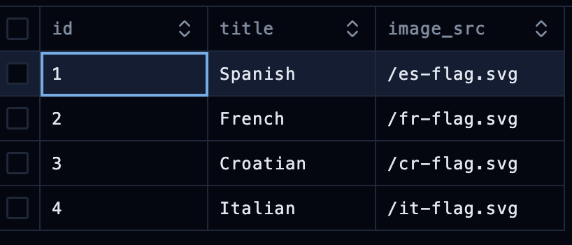
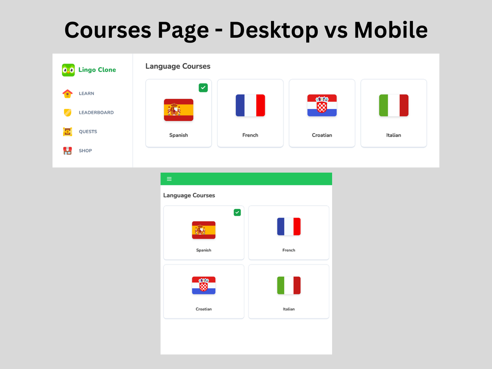

# 09 Courses Page

## Table of Contents

- [Updating the Courses Schema](#updating-the-courses-schema)
    - [Creating the Courses Page](#creating-the-courses-page)
    - [Retrieving Course Entries](#retrieving-course-entries)
    - [Creating the List Component](#creating-the-list-component)
    - [Creating the Card Component](#creating-the-card-component)


## Updating the Courses Schema

We want to start this section of the project by adding more courses to our newly created [schema](/lingo/db/schema.ts). For that, we need to access our `db:studio` via the command:

```bash
npm run db:studio
```

This command will run the database and prompt a link from the terminal to access the Drizzle Studio: https://local.drizzle.studio.

<div align="center">

</div>

Now we have four language courses set up in our database, enough for creating the Courses page.

## Creating the Courses Page

Redirecting back to the `(main)/` directory, we'll create a new route folder called **`courses/`** and within it, a `page.tsx` file:

#### `(main)/courses/page.tsx`

```tsx
const CoursesPage = () => {
    return (
        <div className="h-full max-w-[912px] px-3 mx-auto">
            <h1 className="text-2xl font-bold text-neutral-700">
                Language Courses
            </h1>
            
        </div>
    );
};

export default CoursesPage;
```

### Retrieving Course Entries

Now we'll want to create a database query to fetch our courses from the database. To do this, we'll need to go back to our **`db/`** directory and create a new file called **`queries.ts`**.

#### `db/queries.ts`

```ts
import { cache  } from "react";
import db from "@/db/drizzle";

export const getCourses = cache(async () => {
    const data = await db.query.courses.findMany();
    
    return data;
});
```

By using the `import { cache } from "react"`, we can get all the courses as well as their queries without having to pass the props every time, improving efficiency as queries will be cached instead of re-executing the queries against the database.

This will also be an asynchronous query. Retrieving courses asynchronously allows the application to continue executing other tasks while waiting for the database query to complete. This improves overall responsiveness and performance, as it prevents the user interface from becoming unresponsive or blocking other operations while waiting for the data to be fetched from the database.

So when returning back to the `courses/page.tsx`, we'll need to alter the CoursesPage function to also include `async-await` for course retrieval. To test if the query was set up properly, we'll use `JSON.stringify()` to render the course data inputted earlier:

#### `courses/page.tsx`

```tsx
import { getCourses } from "@/db/queries";
import { List } from "./list";

const CoursesPage = async () => {
    const coursesData = await getCourses();
    
    return (
        <div className="h-full max-w-[912px] px-3 mx-auto">
            <h1 className="text-2xl font-bold text-neutral-700">
                Language Courses
            </h1>
            { JSON.stringify(data) }
        </div>
    );
};

export default CoursesPage;
```

### Creating the List Component

After confirming that works, we'll want to render the actual course item. Let's start by creating a component within the `courses/` route folder called **`list.tsx`** with the props of `courses` and `activeCourseId`. This will be useful; about this is that we can use the type of "courses" as a Prop for this component. For instance:

#### `courses/list.tsx`

```tsx
"use client"

import { courses } from "@/db/schema"
import { Card } from "./card";

type Props = {
    courses: typeof courses.$inferSelect[];
    activeCourseId: number;
};

export const List = ({ courses, activeCourseId }: Props) => {
    return (
        <div className="pt-6 grid grid-cols-2 lg:grid-cols-[repeat(auto-fill,minmax(210px,1fr))] gap-4">
            {courses.map((course) => (
                <Card
                    key={course.id}
                    id={course.id}
                    title={course.title}
                    imageSrc={course.imageSrc}
                    onClick={() => {}}
                    disabled={false}
                    active={course.id === activeCourseId}
                />
            ))}
        </div>
    );
};
```

Now we'll need to render the individual card that will display the course.

### Creating the Card Component

This component will also be created within the `courses/` directory. It does not need to have the `"use client"` import since it will be imported into the <List /> component that is already set up with that configuration. The setup will be as such: 

#### `courses/card.tsx`

```tsx
import { cn } from "@/lib/utils";
import { Check } from "lucide-react";
import Image from "next/image";

type Props = {
    title: string;
    id: number;
    imageSrc: string;
    onClick: (id: number) => void;
    disabled?: boolean;
    active?: boolean;
};

export const Card = ({
    title,
    id,
    imageSrc,
    disabled,
    onClick,
    active,
}: Props) => {
    return (
        <div
            onClick={() => onClick(id)}
            className={cn(
                "h-full border-2 rounded-xl border-b-4 hover:bg-black/5 cursor-pointer active:border-b-2 flex flex-col items-center justify-between p-3 pb-6 min-h-[217px] min-w-[200px]",
                disabled && "pointer-events-none opacity-50"
            )}
        >
            <div className="min-[24px] w-full flex items-center justify-end">
                {active && (
                    <div className="rounded-md bg-green-600 flex items-center justify-center p-1.5">
                        <Check className="text-white stroke-[4] h-4 w-4" />
                    </div>
                )}
            </div>
            <Image
                src={imageSrc}
                alt={title}
                height={70}
                width={93.33}
                className="rounded-lg drop-shadow-md border object-cover"
            />
            <p className="text-neutral-700 text-center font-bold mt-3">
                {title}
            </p>
        </div>
    );
};
```

- The Card component will utilize dynamic styling using `className={cn()}` and with the `cn` utils import.

- The checkmark that is rendered for the active course will be rendered from the `{ Check }` import from the `"lucide-react"` library.

- Instead of importing flags from the `public/` directory of our project, we'll import them directly from the database as these entities exist as a database item to be accessed within the app.

Below is the Courses Page setup based on what we defined in the database:

<div align="center">

</div>