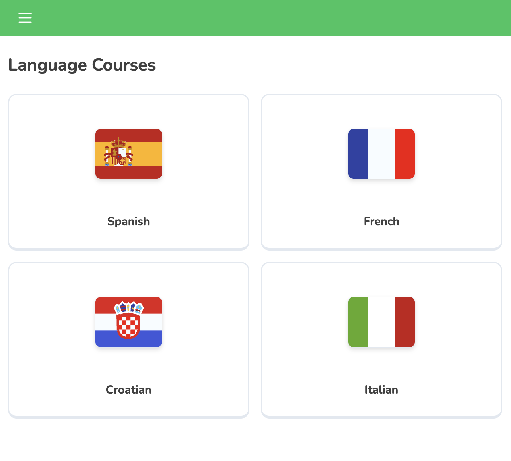
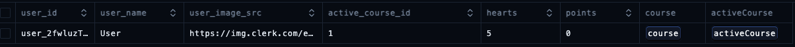

# 10 User Progress

For the next part of the project, we'll need a new schema model for user progress as we don't want users to be able to access any links within the Learn page if they do not already have a course selected. They will only be able to access the Courses page to select a language to learn before accessing any of their stats or other features.

## Table of Contents
- [Creating the User Progress Schema](#creating-the-user-progress-schema)
    - [Establishing the Relationships](#establishing-the-relationships)
    - [Troubleshooting Drizzle Migrations](#troubleshooting-drizzle-migrations)
    - [Creating the User Progress Query](#creating-the-user-progress-query)
- [Integrating User Progress to Front End](#integrating-user-progress-to-front-end)
    - [Updating the Courses Page](#updating-the-courses-page)
    - [Alternative Method: Promises vs Async-Await](#alternative-method-promises-vs-async-await)
    - [Updating the Learn Page](#updating-the-learn-page)
    - [Loader Component](#loader-component)
- [Establishing User Progress Creation](#establishing-user-progress-creation)
    - [Server Actions Folder](#server-actions-folder)
    - [Updating the List Component](#updating-the-list-component)

## Creating the User Progress Schema

We'll return to the file containing our courses schema to create a new table that will store the courses the user is currently taking. This will involve creating a new table called **`userProgress`**. This table will contain the following attributes to track the progress of individual users in the language courses as well as columns for the user ID, username, user image source, active course ID, hearts (or lives), and points.

#### `db/schema.ts`

```tsx
export const userProgress = pgTable("user_progress", {
    userId: text("user_id").primaryKey(),
    userName: text("user_name").notNull().default("User"),
    userImageSrc: text("user_image_src").notNull().default("/mascot.svg"),
    activeCourseId: integer("active_course_id").references(() => courses.id, { onDelete: "cascade" }),
    hearts: integer("hearts").notNull().default(5),
    points: integer("points").notNull().default(0),
});
```

The column `activeCourseId` will be unique because we want it to refer to whichever course the user is taking out of the courses schema. If the user decides to no longer take this course, their progress within it will be deleted, but not the course's content.

Now that that's set, we need to define the relationship between the tables `courses` and `userProgress`:

### Establishing the Relationships

Let's create another function called **`coursesRelations`** between courses and userProgress. This function establishes relationships for the courses table, defining a many-to-many relationship with the userProgress table, indicating that many user progress records can be associated with each course.

```tsx
export const coursesRelations = relations(courses, ({ many }) => ({
    userProgress: many(userProgress),
}));
```

Now below the userProgress table, another function will be created, **userProgressRelations**. This function establishes relationships for the userProgress table and defines a one-to-many relationship with the courses table, indicating that each user progress record corresponds to one active course.

```tsx
export const userProgressRelations = relations(userProgress, ({ one }) => ({
    activeCourse: one(courses, {
        fields: [userProgress.activeCourseId],
        references: [courses.id],
    }),
}));
```

Let's now push this to the database using our custom command and wait for the changes to be applied:

```bash
npm run db:push
[✓] Changes applied
```

Afterwards, we can run the command to access Drizzle Studio and see our newly created table and relationships.

### Troubleshooting Drizzle Migrations

If at any point something was wrong in the code pushed to the database, we can resolve this by simply changing the environment key saved in the `.env` file. This is essentially removing the existing database and creating a new one by saving a new environment key URL to the latter. We can then run the commands accordingly as we've done so far. This method of deleting and recreating databases is quicker than just resolving migrations and is also a preference.

### Creating the User Progress Query

We will redirect to the `queries.ts` file and prepare a query for retrieving the user progress:

#### `db/queries.tsx`

```tsx
import { cache } from "react";
import { auth } from "@clerk/nextjs/server";
import { eq } from "drizzle-orm";

import db from "@/db/drizzle";
import { userProgress } from "@/db/schema";

export const getUserProgress = cache(async () => {
    const { userId } = await auth();
    
    if (!userId) {
        return null;
    }
    
    const data = await db.query.userProgress.findFirst({
        where: eq(userProgress.userId, userId),
        with: {
            activeCourse: true,
        },
    });
    return data;
});

/* Code omitted for brevity
    export const getCourses = cache(async () => {... }); */
```

1. **Purpose**: This function will be called `getUserProgress` and will be created just right before the `getCourses` function. It will also utilize `cache` and `async-await`. The asynchronous function will be set up in a way in which the `{userId}` will be extracted from `await auth()` from Clerk.

2. **Condition**: If a user does not exist, null will be returned, indicating that there is no user progress to be returned. Otherwise, we'll create a `data` variable to retrieve the first user progress data (from the imported userProgress table) that matches—as indicated from within the `.findFirst({})` query—as well as what course that user is active in.

## Integrating User Progress to Front End

### Updating the Courses Page

Returning back to the Courses Page, we'll import this new query under `coursesData`. With that, we can now go into the **`<List />`** component's props and change the contents of the `activeCourseId={}` prop to include the following:

#### `courses/page.tsx`

```tsx
activeCourseId={userProgress?.activeCourseId}
```

Upon saving, an error will appear. This is due to how the `activeCourseId` was typed in the `Props` function of `list.tsx`. Resolve this by changing this to the exact type of the **`userProgress`** schema.

#### `courses/list.tsx`

```tsx
import { courses, userProgress } from "@/db/schema";

type Props = {
    courses: typeof courses.$inferSelect[];
    activeCourseId?: typeof userProgress.$inferSelect.activeCourseId;
};
```

### Alternative Method: Promises vs Async-Await

This may be used as another approach to render this data and is sometimes the convention for some companies.

```tsx
const CoursesPage = async () => {
    const coursesData = getCourses();
    const userProgressData = getUserProgress();
    
    const [
        courses,
        userProgress,
    ] = await Promise.all([coursesData, userProgressData]);
    
    return(/* ... */);
};
```

### Updating the Learn Page

Returning back to the Learn Page, we'll also make this an asynchronous page and import the queries for `userProgressData` to make a Promise.

#### `learn/page.tsx`

```tsx
// ! New imports below
import { UserProgress } from "@/components/user-progress";
import { redirect } from "next/navigation";

const LearnPage = async () => {
    const userProgressData = getUserProgress();
    
    const [
        userProgress,
    ] = await Promise.all([
        userProgressData,
    ]);
    
    if (!userProgress || !userProgress.activeCourse) {
        redirect("/courses");
    }
    
    return (/* ... */);
};
```

This will allow us to redirect the user to the Courses Page if they have yet to start learning a language course as it should be impossible to view the Learn Page for a course that the user is not actively learning and making progress in.

<div align="center">

</div>

### Loader Component

A white blank may show every time a user tries to access the Learn Page when there are no active courses enabled. To resolve this, we can add a Loader component and make the page loading more natural as users are being redirected.

#### `learn/loader.tsx`

```tsx
import { Loader } from "lucide-react";

export const Loading = () => {
    return (
        <div className="h-full w-full flex items-center justify-center">
            <Loader className="h-6 w-6 text-muted-foreground animate-spin" />
        </div>
    );
};

export default Loading;
```

The Loader component will be set up like this and we can copy another one for the `courses/` directory as well. No importing is necessary as it fulfills its role by simply existing in the route folder.


## Establishing User Progress Creation

For this next section, we want to configure the course buttons so that they can create a new user progress entry in the database. To do this, we need to create the necessary queries for this database action.

We'll start by creating an asynchronous function that accepts a `courseId` of type number and searches for the course:

#### `db/queries.tsx`

```tsx
export const getCourseById = cache(async (courseId: number) => {
    const data = await db.query.courses.findFirst({
        where: eq(courses.id, courseId),
        // TODO: Populate units and lessons
    });
    
    return data;
});
```

** For now, we'll add a "todo" message because we have yet to create the tables for units and lessons. Once established, they will be useful for loading out the course content upon accessing the course.

We'll now redirect back to the List component where we'll take advantage of `"use client"` as interactive clicks will take place.

#### `courses/list.tsx`

```tsx
"use client"

import { useTransition } from "react";
import { useRouter } from "next/navigation";

import { courses, userProgress } from "@/db/schema"

type Props = {
    courses: typeof courses.$inferSelect[];
    activeCourseId?: typeof userProgress.$inferSelect.activeCourseId;
};

export const List = ({ courses, activeCourseId }: Props) => {
    const router = useRouter();
    const [pending, startTransition] = useTransition();
    
    const onClick = (id: number) => {
        if (pending) return;
        
        if (id === activeCourseId) {
            return router.push("/learn");
        }
        
        startTransition(() => {
            upsertUserProgress(id);
        });
    };
    
    return (/* ... */)
}
```

1. Start by importing `useRouter` from "next/navigation". We'll also import `useTransition()` from "react", which will help in using server actions in its pending state.

2. Then, we will use an `onClick` function that accepts an `id`. If the course is pending, then we'll exit this function. Otherwise, if the user is currently active in a course (where the `id` matches the `courseId`), we want to break out of the function to avoid redundant database updates. Then, redirect the user to the Learn Page.

3. We now want to create a function in case the user selects a new course, `startTransition()`. However, this uses a server action which doesn't exist yet. So, we'll create the logic for that in the upcoming subsection.

### Server Actions Folder

In the root folder of our project, we'll create a new directory called **`actions/`**, and within it, an actions file called **`user-progress.ts`**. To ensure it behaves properly as a server action, define `"use server"` at the top, otherwise it won't work.

#### `actions/user-progress.ts`

1. In the asynchronous method, `upsertUserProgress`, we'll start by ensuring that both user and course entities exist by (1) extracting the `userId` to retrieve the entire user data from the current user authenticated with Clerk, and then (2) fetching the course that the user selected using the `courseId`.

    ```ts
    "use server"
    
    import { redirect } from "next/navigation";
    import { revalidatePath } from "next/cache";
    import { auth, currentUser } from "@clerk/nextjs/server"
    
    import db from "@/db/drizzle";
    import { userProgress } from "@/db/schema";
    import { getCourseById, getUserProgress } from "@/db/queries";
    
    export const upsertUserProgress = async (courseId: number) => {
        const { userId } = await auth();
        const user = await currentUser();
        
        if (!userId || !user) {
            throw new Error("Unauthorized");
        }
        
        const course = await getCourseById(courseId);
        
        if (!course) {
            throw new Error("Course not found");
        }
    }
    ```

2. We'll also add a conditional statement to check if units and lessons exist within a course, but since these entities don't exist yet at this point of the project, we'll comment this out.
    ```ts
    export const upsertUserProgress = async (courseId: number) => {
        // TODO: Enable once units and lessons are added
        if (!course.units.length || !course.units[0].lessons.length) {
            throw new Error("Course is empty");
        }
    }
    ```

3. The next line checks if user progress exists. If so, it means that the user has been active in a course, and we need to update the `userProgress` schema for that user, then redirect them to the appropriate link.
    ```ts
    export const upsertUserProgress = async (courseId: number) => {
        // ...
        const existingUserProgress = await getUserProgress();
        
        if (existingUserProgress) {
            await db.update(userProgress).set({
                activeCourseId: courseId,
                userName: user.firstName || "User",
                userImageSrc: user.imageUrl || "/mascot.svg",
            });
            
            revalidatePath("/courses");
            revalidatePath("/learn");
            redirect("/learn");
        }
    }
    ```

4. If no existing progress is found, insert a new progress record with the provided course ID and user details. Then, revalidate the "/courses" and "/learn" paths to ensure the cache is updated, and redirect the user to the "/learn" page.
    ```ts
    export const upsertUserProgress = async (courseId: number) => {
        // ...
        await db.insert(userProgress).values({
            userId,
            activeCourseId: courseId,
            userName: user.firstName || "User",
            userImageSrc: user.imageUrl || "/mascot.svg",
        });
        
        revalidatePath("/courses");
        revalidatePath("/learn");
        redirect("/learn");
    }
    ```

Now upon clicking a course, user progress will be created and users will now be able to access the Learn Page.

### Updating the List Component

We can now pass the `onClick` functionality since the `user-progress.ts` is now set up.

We'll also configure the `disabled={}` property to `pending` so it appears faded out while the page is loading, performing the "upsert" action:

```tsx
return (
    <div>
        {/* ... */}
        <Card
            key={course.id}
            id={course.id}
            title={course.title}
            imageSrc={course.imageSrc}
            onClick={onClick}
            disabled={pending}
            active={course.id === activeCourseId}
        />
        {/* ... */}
    </div>
)
```

### Accessing User Progress with Drizzle Studio

With the command `npm run db:studio`, we can see our `user_progress` table updated as we access the selected course:

<div align="center">

</div>
