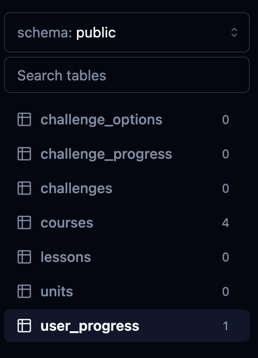

# Schema

So far in our `database/schema.ts` file, we have defined the **courses** and **user progress** tables, as well as the relationships between these tables.

## Table of Contents

- [Units](#units)
    - [Defining Units' Relationship to Courses](#defining-units-relationship-to-courses)
- [Lessons](#lessons)
    - [Lessons Relationship](#lessons-relationship)
- [Challenges](#challenges)
    - [Challenges Relationship](#challenges-relationship)
- [Challenge Options](#challenge-options)
    - [Challenge Options Relationship](#challenge-options-relationship)
- [Challenge Progress](#challenge-progress)
    - [Challenge Progress Relationship](#challenge-progress-relationship)
- [One More Missing Factor: User Subscription](#one-more-missing-factor-user-subscription)
- [Pushing Everything to the Database](#pushing-everything-to-the-database)
- [Troubleshooting: Types in Table Names](#troubleshooting-types-in-table-names)

Now let's wrap up the schema. For the next queries we need to load, which will display the current unit for the course, its lessons, subsequent units and lessons, and the user progress showing if the lesson or unit is unlocked, we need to have the necessary fields for such complex queries in the database. Let's start by creating the **`units`** table.

## Units

Under the `coursesRelations` function, create the `units` table as such:

#### `schema.ts`

```ts
export const units = pgTable("units", {
    id: serial("id").primaryKey(),
    title: text("title").notNull(), // Unit 1
    description: text("description").notNull(), // Learn the basics of Spanish
    courseId: integer("course_id").references(() => courses.id, { onDelete: "cascade" }).notNull(),
    order: integer("order").notNull(),
});
```

Of course, we need the `courseId` so the units know what course this unit is for. We need to define it as an integer to reference the course's ID from the list of courses existing in the database. Also, we need to enable CASCADE on delete so that all units related to that course disappear along with the course itself.

The order property is necessary so that the schema will know how to render it when it is displayed on the Learn Page.

### Defining Units' Relationship to Courses

Underneath `units`, we need to define this table's relationship with the new function called `unitsRelations`.

```ts
export const unitsRelations = relations(units, ({ many, one }) => ({
    course: one(courses, {
        fields: [units.courseId],
        references: [courses.id],
    }),
}));
```

We'll go back to the **`coursesRelations`** and add the courses' relationship to `units` here:

```ts
export const coursesRelations = relations(courses, ({ many }) => ({
    userProgress: many(userProgress),
    units: many(units), // NEW
}));
```

## Lessons

Following `unitsRelations`, let's create the **`lessons`** schema:

```ts
export const lessons = pgTable("lessons", {
    id: serial("id").primaryKey(),
    title: text("title").notNull(),
    unitId: integer("unit_id").references(() => units.id, { onDelete: "cascade" }).notNull(),
    order: integer("order").notNull(),
});
```

Like the `units` table, we need to associate the lesson with its corresponding unit, hence the `unitId` property.

### Lessons Relationship

Similarly to `unitsRelations`, define the `lessonsRelations` like this:

```ts
export const lessonsRelations = relations(lessons, ({ one, many }) => ({
    unit: one(units, {
        fields: [lessons.unitId],
        references: [units.id],
    }),
}));
```

We'll then return to the `unitsRelations` function and add lessons so we can establish a many-to-many relationship:

```ts
export const unitsRelations = relations(units, ({ many, one }) => ({
    course: one(courses, {
        // fields and references omitted...
    }),
    lessons: many(lessons),
}));
```

To summarize, each unit can have many lessons, but each individual lesson can only have one unit.

There is still something missing from lessons — `challenges`, the content within the lessons. This will be another table we'll need to create. It can follow the same structure as `lessons`:

## Challenges

```ts
export const challenges = pgTable("challenges", {
    id: serial("id").primaryKey(),
    lessonId: integer("lesson_id").references(() => lessons.id, { onDelete: "cascade" }).notNull(),
});
```

We'll leave challenges like this as we need to have a `typeof` challenge using `enums`. When creating this next table, we'll need to `import { pgEnum } from drizzle-orm`.

```ts
export const challengesEnum = pgEnum("type", ["SELECT", "ASSIST"]);
```

Now that's set up, we can go back to the **`challenges`** table and use this new `typeof` attribute:

```ts
export const challenges = pgTable("challenges", {
    id: serial("id").primaryKey(),
    lessonId: integer("lesson_id").references(() => lessons.id, { onDelete: "cascade" }).notNull(),
    type: challengesEnum("type").notNull(),
    question: text("question").notNull(),
    order: integer("order").notNull(),
});
```

The `question` property may be named too specifically, but this is where "SELECT" and "ASSIST" will come in handy because the question can appear in the form of questions or as a simple word awaiting its translation.

### Challenges Relationship

Set up `challengesRelations` as such:

```ts
export const challengesRelations = relations(challenges, ({ one, many }) => ({
    lesson: one(lessons, {
        fields: [challenges.lessonId],
        references: [lessons.id],
    }),
}));
```

Returning to the `lessonsRelations`, we are going to add `challenges` as a _`many`_ property:

```ts
export const lessonsRelations = relations(lessons, ({ one, many }) => ({
    unit: one(units, {
        fields: [lessons.unitId],
        references: [units.id],
    }),
    challenges: many(challenges),
}));
```

## Challenge Options

Underneath the `challengesRelations` function, create another table called **`challengeOptions`**:

```ts
export const challengeOptions = pgTable("challengeOptions", {
    id: serial("id").primaryKey(),
    challengeId: integer("challenge_id").references(() => challenges.id, { onDelete: "cascade" }).notNull(),
    text: text("text").notNull(),
    correct: boolean("correct").notNull(),
    imageSrc: text("image_src"),
});
```

This will represent the answers inputted by the user as well as how they're presented to the user with picture and audio, if provided.

### Challenge Options Relationship

The `challengeOptionsRelations` is set up so that each challenge can have many challenge options, whereas each challenge option can only have one challenge.

```ts
export const challengeOptionsRelations = relations(challengeOptions, ({ one }) => ({
    challenge: one(challenges, {
        fields: [challengeOptions.challengeId],
        references: [challenges.id],
    }),
}));
```

Update the `challengesRelations` table as:

```ts
export const challengesRelations = relations(challenges, ({ one, many }) => ({
    lesson: one(lessons, {
        fields: [challenges.lessonId],
        references: [lessons.id],
    }),
    challengeOptions: many(challengeOptions),
}));
```

## Challenge Progress

The `challengeProgress` table is set up as:

```ts
export const challengeProgress = pgTable("challengeProgress", {
    id: serial("id").primaryKey(),
    userId: text("user_id").notNull(), // TODO: Confirm this doesn't break
    challengeId: integer("challenge_id").references(() => challenges.id, { onDelete: "cascade" }).notNull(),
    completed: boolean("completed").notNull().default(false),
});
```

### Challenge Progress Relationship

```ts
export const challengeProgressRelations = relations(challengeProgress, ({ one }) => ({
    challenge: one(challenges, {
        fields: [challengeProgress.challengeId],
        references: [challenges.id],
    }),
}));
```

Go back to the `challengesRelations` table and update it:

```ts
export const challengesRelations = relations(challenges, ({ one, many }) => ({
    lesson: one(lessons, {
        fields: [challenges.lessonId],
        references: [lessons.id],
    }),
    challengeOptions: many(challengeOptions),
    challengeProgress: many(challengeProgress),
}));
```

## One More Missing Factor: User Subscription

The last table we need in our schema is the **User Subscription** table, but this will be left for later as it is not needed right now for the next section of this project's development.

## Pushing Everything to the Database

So now we can go to our terminal for the database and run:

```bash
npm run db:studio
```

If there are problems, we can close it and run `npm run db:push` and then `npm run db:studio` to see all the changes applied.

<div align="center">

</div>

If there were problems with the relations in the database, Drizzle would have thrown an error. But since all our code is good, we can now continue to the next section.

## Troubleshooting: Types in Table Names

If for whatever reason, the tables appear to be in camel case instead of snake case, we can simply go back to our table in the `schema.ts` and rename it in the string after `pgTable("")`. Then, when we push it up to the database, we can be given the option to rename the table so we don't have to go in and delete it ourselves. Run it and see the changes applied.