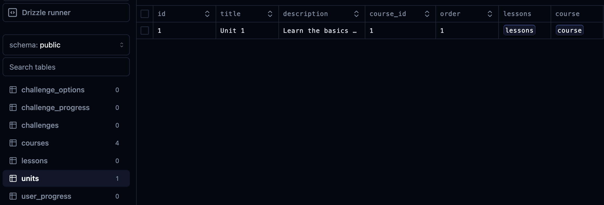
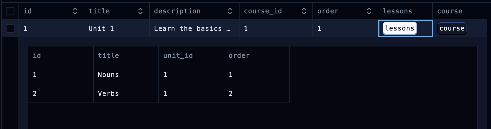
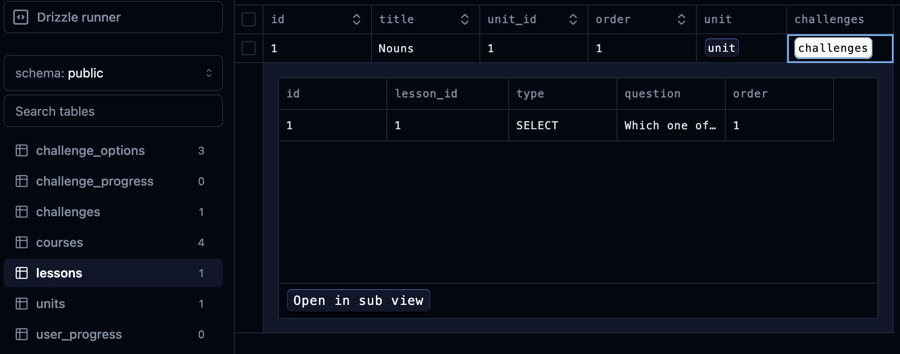
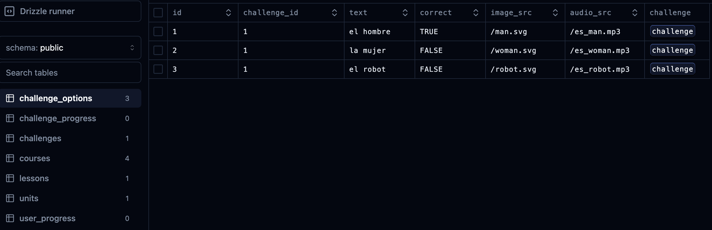
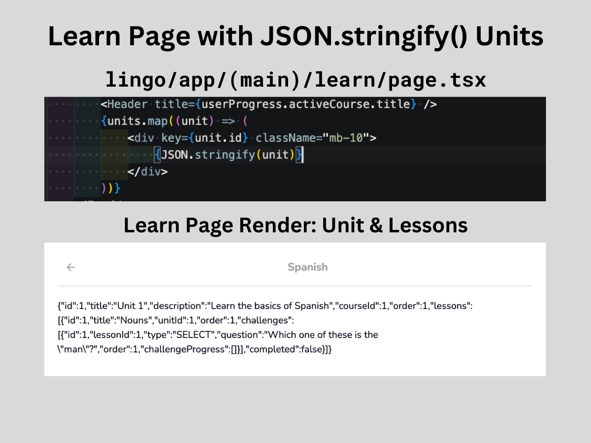

# Units

At this point, the schema should now be set up to create a couple of units, lessons, challenges, and challenge options.

## Creating a Unit via Seed Script

Let's revisit the seed script.

Inside the `try{}` statement, add a `delete` method to delete our newly created tables.

#### `scripts/seed.ts`

```ts
try {
    await db.delete(schema.units);
    await db.delete(schema.lessons);
    await db.delete(schema.challenges);
    await db.delete(schema.challengeOptions);
    await db.delete(schema.challengeProgress);
}
```

Since each course already has an `id`, this will be useful for creating the units. Using the Spanish course as an example, add another `insert` method after the list of courses to create the units:

```ts
await db.insert(schema.units).values([
    {
        id: 1,
        courseId: 1, // Spanish
        title: "Unit 1",
        description: "Learn the basics of Spanish",
        order: 1
    }
]);
```

Let's prepare that with our `db:studio` command and in another terminal use the `db:seed` command. When we refresh Drizzle Studio, the `units` table will now have the unit we just set up.

<div align="center">

</div>

If we were to visit the units for the other courses, they will not have this unit, only the Spanish course.

## Creating Lessons via Seed Script

The `lesson` column of this unit entry is still empty. To add content, we'll return to the seed script and create a new `insert` method to make two lessons for this unit:

#### `scripts/seed.ts`

```ts
await db.insert(schema.lessons).values([
    {
        id: 1,
        unitId: 1, // Unit 1 (Learn the basics...)
        order: 1,
        title: "Nouns"
    },
    {
        id: 2,
        unitId: 1,
        order: 2,
        title: "Verbs"
    },
]);
```

With Drizzle Studio still running, run the `db:seed` command again to see the newly added lessons.

<div align="center">

</div>

## Creating Challenges via Seed Script

Now let's create challenges and challenge options:

#### `scripts/seed.ts`

```ts
await db.insert(schema.challenges).values([
    {
        id: 1,
        lessonId: 1, // Nouns
        type: "SELECT",
        order: 1,
        question: 'Which one of these is the "man"?'
    },
]);

await db.insert(schema.challengeOptions).values([
    {
        id: 1,
        challengeId: 1, // Which one of these is the "man"?
        imageSrc: "/man.svg",
        correct: true,
        text: "el hombre",
        audioSrc: "/es_man.mp3",
    },
    {
        id: 2,
        challengeId: 1,
        imageSrc: "/woman.svg",
        correct: false,
        text: "la mujer",
        audioSrc: "/es_woman.mp3",
    },
    {
        id: 3,
        challengeId: 1,
        imageSrc: "/robot.svg",
        correct: false,
        text: "el robot",
        audioSrc: "/es_robot.mp3",
    },
]);
```

**Note I:** Although we are still missing the audio files at this point of the project, we'll later use 11 Labs AI to generate AI voices for different languages.

**Note II:** One more thing we'll need when we get to that point is to create one more challenge of a different type, "ASSIST", as we have only set up a challenge of "SELECT".

This is everything we need. Let's seed all this to the database now to see the tables in Drizzle Studio update:

<div align="center">

</div>

<div align="center">

</div>

## Rendering Units and Lessons on the Learn Page (For Spanish Course)

We can leave the Seed Script and go to our live app. Because the lesson, challenge, and challenge options created were for the Spanish Course, we're going to work on the Learn Page for Spanish.

Navigate to the Learn Page's **`learn/page.tsx`** and open that along with **`db/queries.ts`**. We need a query to be able to fetch the units, lessons, and challenges.

Our first query will be called `getUnits`. However, with this query, we want to also call all the lessons and challenges within that unit. We also want to normalize our data in the front end in a way that introduces a new field called "completed". This is not a status that needs to be stored in the database or be constantly updated. Rather, this is where **challenge progress** will come into play to detect whether the user finished this lesson or not.

### Backend: `getUnits` Query

Certainly! Here's a clearer explanation of how the `getUnits` query is set up:

### Backend: `getUnits` Query

Let's create a new query called `getUnits` that will fetch the units along with their associated lessons and challenges. This query will also check the progress of each challenge to determine if the lesson is completed.

Here's how you can set up the `getUnits` query:

1. **Create the Query Function**: 
   Define the `getUnits` function as a cached asynchronous arrow function. This will help improve performance by caching the results of the query.

2. **Fetch User Progress**: 
   Retrieve the user's progress to check if the user is currently active in a course. If there is no active course, return an empty array.

3. **Fetch Units Data**:
   Use the `db.query.units.findMany` method to get all units for the active course. This query also fetches the associated lessons, challenges, and challenge progress using the `with` clause.

4. **Normalize the Data**:
   Process the fetched data to include a `completed` status for each lesson. This status is determined by checking if all challenges within a lesson are completed.

Here's the code for the `getUnits` query:

```ts
export const getUnits = cache(async () => {
    const userProgress = await getUserProgress();
    
    if (!userProgress?.activeCourseId) {
        return [];
    }
    
    const data = await db.query.units.findMany({
        where: eq(units.courseId, userProgress.activeCourseId),
        with: {
            lessons: {
                with: {
                    challenges: {
                        with: {
                            challengeProgress: true,
                        },
                    },
                },
            },
        },
    });
    
    const normalizedData = data.map((unit) => {
        const lessonsWithCompletedStatus = unit.lessons.map((lesson) => {
            const allCompletedChallenges = lesson.challenges.every((challenge) => {
                return challenge.challengeProgress
                    && challenge.challengeProgress.length > 0
                    && challenge.challengeProgress.every((progress) => progress.completed);
            });
            
            return { ...lesson, completed: allCompletedChallenges }
        });
        
        return { ...unit, lessons: lessonsWithCompletedStatus };
    });
    
    return normalizedData;
});
```

### Explanation of the Query:

1. **Check User Progress**: 
   - The function starts by fetching the user's progress using `getUserProgress()`.
   - If there is no active course, it returns an empty array.

2. **Fetch Units and Related Data**: 
   - The query fetches all units where `courseId` matches the user's `activeCourseId`.
   - It includes related lessons, challenges, and their progress using the `with` clause.

3. **Normalize Data**:
   - The fetched data is mapped to add a `completed` status to each lesson.
   - For each lesson, it checks if all challenges are completed.
   - If all challenges within a lesson are completed, it sets `completed: true` for that lesson.

### Frontend: Learn Page

On the frontend, we will use the `getUnits` query to fetch and display the units and their associated lessons.

1. **Fetch Data**:
   - Use `Promise.all` to fetch both `userProgress` and `units` data simultaneously.

2. **Render Data**:
   - Map over the fetched units and render each unit's data.

Here's the code for the Learn Page:

#### `learn/page.tsx`

```tsx
const LearnPage = async () => {
    const userProgressData = getUserProgress();
    const unitsData = getUnits();
    
    const [
        userProgress,
        units,
    ] = await Promise.all([
        userProgressData,
        unitsData,
    ]);
    
    return (
        <div>
            {/* ...omitted code...*/}
            <FeedWrapper>
                {units.map((unit) => (
                    <div key={unit.id} className="mb-10">
                        {JSON.stringify(unit)}
                    </div>
                ))}
            </FeedWrapper>
        </div>
    )
}
```

This code fetches the necessary data and renders it on the Learn Page, displaying the units and their associated lessons. The render will look like below:

<div align="center">

</div>

The next section will focus on the UI of the lessons.