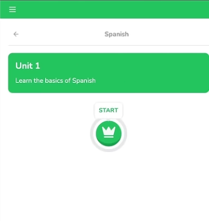
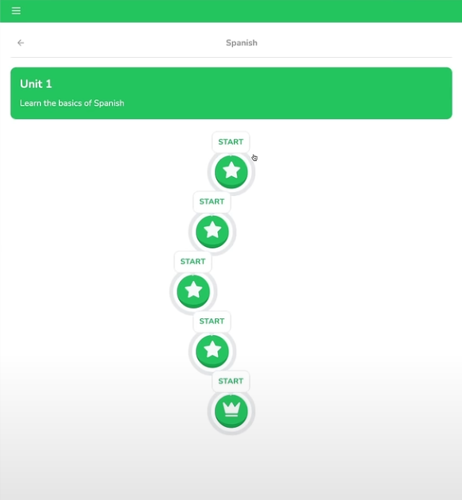

# 14 Lesson Buttons

Before diving into the UI for the lesson buttons, we're going to revisit the queries file, specifically the `getUnits` function.

## Updating the Challenge Progress Query

There is a lack of filtering for `challengeProgress` for all challenges. Since we already defined `userId` in the schema for `challengeProgress`, we should query that `userId` to retrieve a user's challenge progress.

We can start by destructuring the `userId` in the `getUnits` query and extending the if statement to check if either the `userId` or `userProgress` exists:

#### `queries.ts`

```ts
export const getUnits = cache(async () => {
    const { userId } = await auth(); // NEW
    const userProgress = await getUserProgress();
    
    if (!userId || !userProgress?.activeCourseId) { // UPDATED
        return [];
    }
});
```

Within the `.findMany()` query, we'll add more parameters to extract the `userId` from the `auth()` method and from the `challengeProgress`:

```ts
challengeProgress: {
    where: eq(
        challengeProgress.userId,
        userId
    )
},
```

## Rendering the Units and Lessons

Now we can navigate to the Learn Page and go to where we were rendering the `units` with `JSON.stringify()`. This JSON code will be replaced with an actual unit component to render. For this component, the following props are needed:

#### `(main)/learn/page.tsx`

```tsx
{units.map((unit) => (
    <div key={unit.id} className="mb-10">
        <Unit
            id={unit.id}
            order={unit.order}
            description={unit.description}
            title={unit.title}
            lessons={unit.lessons}
            activeLesson={undefined}
            activeLessonPercentage={0}
        />
    </div>
))}
```

### Building the `<Unit />` Component

This is a component specific to this Learn Page, so it will be created within the `learn/` route directory as `unit.tsx`:

#### `unit.tsx`

```tsx
import { lessons, units } from "@/db/schema";

type Props = {
    id: number;
    order: number;
    title: string;
    description: string;
    lessons: (typeof lessons.$inferSelect & {
        completed: boolean;
    })[];
    activeLesson: typeof lessons.$inferSelect & {
        unit: typeof units.$inferSelect;
    } | undefined;
    activeLessonPercentage: number;
};
```

Define the props as normal, but with these exceptions:
* When defining **`lessons`**, it will have a `typeof lessons.$inferSelect` attribute where we're normalizing the data in every lesson by having a `completed` boolean and an array in the end.
* The same will be applied for **`activeLesson`**, which will also have the `typeof lessons.$inferSelect` attribute and the `unit` property within. The `activeLesson` property can also be `undefined`.

Establish the component so we can import it to the Learn Page:

```tsx
export const Unit = ({/* props omitted... */}: Props) => {
    return (
        <>Unit</>
    );
}
```

The component will use fragments instead of `<div>`s. Within it, another reusable component will be created, `<UnitBanner />` — this will be a self-closing tag and also created within the `learn/` directory.

### The `<UnitBanner />` Component

First, this component will have the props of `title` and `description`:

#### `learn/unit.tsx`

```tsx
return (
    <>
        <UnitBanner title={title} description={description} />
    </>
)
```

In the `unit-banner.tsx` component, define the props and style it (styling is omitted for brevity). Within the main `<div />`, a `<Link />` tag from "next/link" will be used to direct the users to a future "/lesson" and it will appear as a `<Button />`:

```tsx
return (
    <>
        <Link href="/lesson">
            <Button
                size="lg"
                variant="secondary"
                className="hidden xl:flex border-2 border-b-4 active:border-b-2"
            >
                <NotebookText className="mr-2" />
                Continue
            </Button>
        </Link>
    </>
)
```

** The `<NotebookText />` is imported from "lucide-react" and displays a notebook icon.

#### `learn/unit.tsx`

Returning to the main `<Unit />` component, in a `<div />` under the `<UnitBanner />`, we'll map the lessons where the `lesson` and `index` will be extracted. From this, a method will be opened where:
- `isCurrent` stores the lesson's `id`, which is equal to the **active lesson's `id`**.
- `isLocked` stores the value when the lesson is not completed (`!lesson.completed`) and that lesson is also not the current one the user is working on (`!isCurrent`).

Having the `isLocked` constant is crucial to ensuring that no users are allowed to access any future lessons that come after an incomplete current lesson, thus locking them. This also permits users to revisit past completed lessons as they do not need to be locked.

We can now return a component holding the lesson called `<LessonButton />`, another component that will be housed specifically within the `learn/` directory. This will include the following props:

```tsx
return (
    <LessonButton
        key={lesson.id}
        id={lesson.id}
        index={index}
        totalCount={unit.lessons.length - 1}
        current={isCurrent}
        locked={isLocked}
        percentage={activeLessonPercentage}
    />
)
```

### Building the `<LessonButton />` Component

This component will be marked as `"use client"` because it's going to be interactive. Create props as usual.

#### `learn/lesson-button.tsx`

```tsx
"use client"

type Props = {
    id: number;
    index: number;
    totalCount: number;
    locked?: boolean;
    current?: boolean;
    percentage: number;
};

export const LessonButton = ({/* props omitted */}: Props) => {
    return (
        <div>Lesson Button {id}</div>
    )
}
```

Styling it is simple; however, the lessons need to be positioned in a way where they curve in and out from their center position, which is difficult. To ensure the buttons will be calculated to their right position, we'll define some variables.

```tsx
export const LessonButton = ({/* props omitted */}: Props) => {
    const cycleLength = 8;
    const cycleIndex = index % cycleLength;
    
    let indentationLevel;
    
    if (cycleIndex <= 2) {
        indentationLevel = cycleIndex;
    } else if (cycleIndex <= 4) {
        indentationLevel = 4 - cycleIndex;
    } else if (cycleIndex <= 6) {
        indentationLevel = 4 - cycleIndex;
    } else {
        indentationLevel = cycleIndex - 8;
    }
    
    const rightPosition = indentationLevel * 40;
    
    const isFirst = index === 0;
    const isLast = index === totalCount;
    const isCompleted = !current && !locked;
    
    const Icon = isCompleted ? Check : isLast ? Crown : Star;
    
    const href = isCompleted ? `/lesson/${id}` : "/lesson";
    
    return (
        <div>Lesson Button {id}</div>
    )
}
```

* The `Icon` constant variable, which uses the icon imports Check, Crown, and Star from "lucide-react", will hold the logic to render the lesson buttons based on the user's progress.

* The `href` constant variable is based on Duolingo's logic where the current lesson will have a default URL string of "/lesson" whereas if it is a past lesson, it will have its `id` following the URL's "lesson" string.

To accurately render the user's progress throughout a lesson, an additional react package called `react-circular-progressbar` is needed. In a separate terminal, install the following:

```bash
npm i react-circular-progressbar
```

Add the imports as such as well as the libraries.

```tsx
"use client"

import Link from "next/link";
import { Check, Crown, Star } from "lucide-react";
import { CircularProgressbarWithChildren } from "react-circular-progressbar";

import { cn } from "@/lib/utils";
import { Button } from "@/components/ui/button";

import "react-circular-progressbar/dist/styles.css";
```

1. The lesson button is entirely a link itself that we'll be returning. So within it, we'll define some basic logic on how it needs to render to the user so that the link is disabled when the lesson is locked.

    ```tsx
    return (
        <Link
            href={href}
            aria-disabled={locked} 
            style={{ pointerEvents: locked ? "none" : "auto" }}
        >
            {/* ,,, */}
        </Link>
    )
    ```

2. Within this `<Link />` tag, a `<div>` will contain some unique styling to have a floating popup indicating the user to start at that lesson.

    ```tsx
    return (
        <Link>
            <div
                className="relative"
                style={{
                    right: `${rightPosition}px`,
                    marginTop: isFirst && !isCompleted ? 60 : 24,
                }}
            >
        </Link>
    )
    ```

3. This next `<div>` within is what will be in charge of rendering the button based on the user progress if it is the current lesson; otherwise, the logic for being locked will be styled accordingly.

    Note: _Due to the code being extensive, go to the component at `app/(main)/learn/lesson-button.tsx`._
    
    * The `<CircularProgressbarWithChildren>` tag will render the accurate progress of the lesson based on what point the user left off on with the appropriate colors to differentiate between completion and incompletion.
    * Within it, a `<Button>` component will be created. This will house a dynamic `<Icon>` tag with styling.

4. There is a new variant called **"locked"** that will need to be created to render the locked state of the lesson button. Navigate to the `button.tsx` file to define the style. (Styling is omitted due to extensiveness).
    
    <div align="center">
    
    </div>

Now we want to test out rendering multiple lessons at a time to see the differing statuses. To do this, we'll need to go back to our seed script and create more lessons.

### Seeding More Lessons to the DB

In the `await` statement, `await db.insert(schema.lessons).values([{...}])`, we'll want to duplicate the first lesson with differing names and incrementing `id` and `order` values.

#### `scripts/seed.ts`

```ts
await db.insert(schema.lessons).values([
    { id: 1, unitId: 1, order: 1, title: "Nouns"},
    { id: 2, unitId: 1, order: 2, title: "Verbs" },
    { id: 3, unitId: 1, order: 3, title: "Adjectives" },
    { id: 4, unitId: 1, order: 4, title: "Adverbs" },
    { id: 5, unitId: 1, order: 5, title: "Pronouns" },
]);
```

Afterwards, seed the database and push it to the database using the `npm db:seed` and `npm db:push` commands. The appearance should be as follows:

<div align="center">

</div>

### Continuing Lesson Button Configuration

Obviously, they would not all be active like this. In the `current` logic, the otherwise statement will include a `<Button>` component as well but with differing logic which will be styled later in the project.
