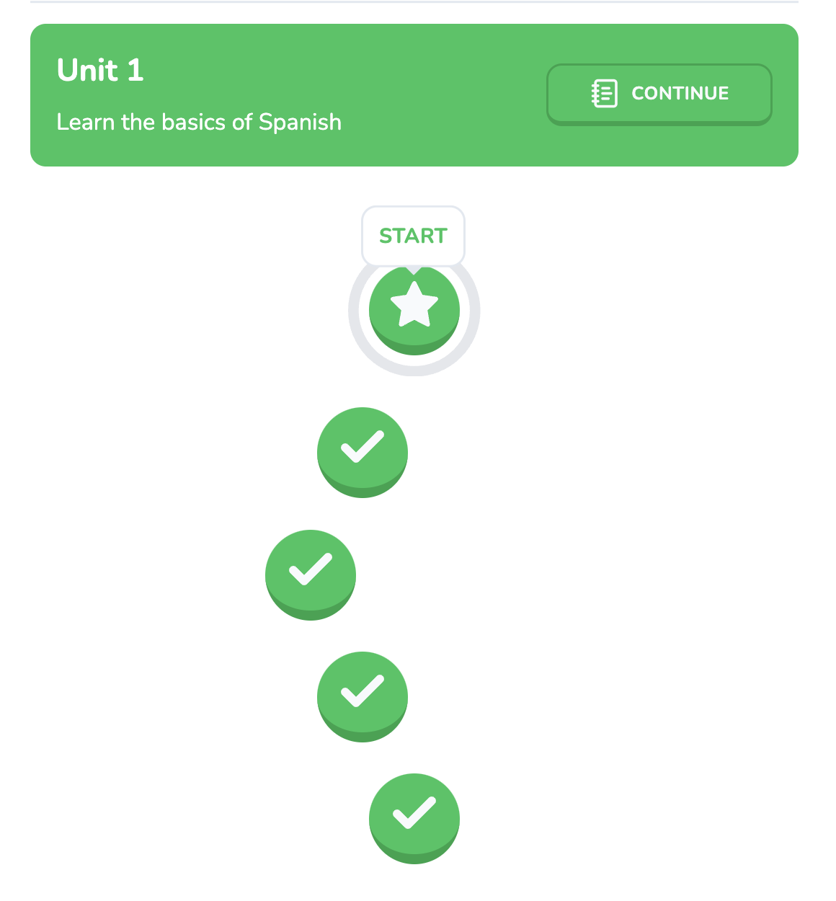
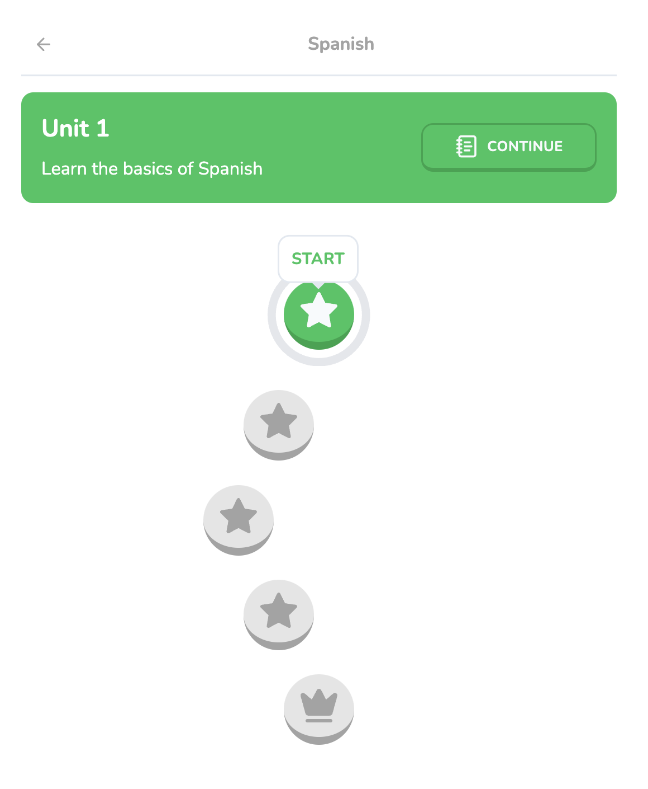

# 15 Course Progress

We need a method for the `activeLesson` and `activeLessonPercentage` properties, as they are undefined, so the lessons can be rendered with actual data from the database properly. To make this possible, revisit the `queries.ts` file.

## New Method: `getCourseProgress`

We're going to create new queries, starting with the `getCourseProgress` method.

1. Similar to the other queries, the method will be set up as an `export const` with a cached asynchronous function. Inside, we'll retrieve the `userId` from authentication and the `userProgress` from the `getUserProgress` query. We'll then ensure that the `userId` or the `userProgress` for that active course exists. If not, return `null` for no progress to be loaded.

2. Now we'll retrieve the units within the course with a new `.findMany()` query called **`unitsInActiveCourse`**.
    - This will be ordered by `units` (imported from the `schema`) and it will be destructured in ascending order, with a similar format for `lessons` within and then for `challenges`. In the `challenges` property, we want to check that `userId` linked with that challenge progress is linked to the `userId` logged in from our `auth()` method:

    ```ts
    const unitsInActiveCourse = await db.query.units.findMany({
        orderBy: (units, { asc }) => [asc(units.order)],
        where: eq(units.courseId, userProgress.activeCourseId),
        with: {
            lessons: {
                orderBy: (lessons, { asc }) => [asc(lessons.order)],
                with: {
                    unit: true,
                    challenges: {
                        with: {
                            challengeProgress: {
                                where: eq(challengeProgress.userId, userId),
                            },
                        },
                    },
                },
            },
        },
    });
    ```

3. We'll need to direct the user to their current lesson. To search for the first uncompleted lesson, we'll create another query called `firstUncompletedLesson` which will search within our `unitsInActiveCourse` query.
    - This will use a `.flatMap()` method to retrieve an individual unit and then `.find()` the lesson where some of its challenges are incomplete. If this entity exists, then return this as non-existent challenge progress so it can be a candidate for the first completed lesson OR if the challenge progress for that challenge is `0` OR the completion status of these challenges is _`false`_:
    
    ```ts
    const firstUncompletedLesson = unitsInActiveCourse
        .flatMap((unit) => unit.lessons)
        .find((lesson) => {
            return lesson.challenges.some((challenge) => {
                return !challenge.challengeProgress 
                    || challenge.challengeProgress.length === 0
                    || challenge.challengeProgress.some((progress) => progress.completed === false);
            });
        });
    ```

4. With the above methods, we can now return something for `activeLesson` and its respective `id`.

The `getCourseProgress` query now has something to return for our units' lesson status. The next step is to retrieve the lessons with a new method called `getLessons`.

## New Method: `getLessons`

1. Set up the method similar to `getCourseProgress` in [Step 1](#new-method-getcourseprogress). The difference, however, is that within the parentheses for `async`, we'll pass a parameter of an optional `id` with the type of _`number`_, as it's a type of serial, not a UUID: 

    ```ts
    export const getLessons = cache(async (id?: number) => {
        const { userId } = await auth();
        if (!userId) {
            return null;
        }
        
        const courseProgress = await getCourseProgress();
        const lessonId = id || courseProgress?.activeLessonId;
        if (!lessonId) {
            return null;
        }
        // ...
    });
    ```
    - Obviously, the `userId` from the `auth()` needs to be checked before processing this method.
    - This method will be useful for when the user wants to practice a specific lesson and the `id` needs to be retrieved; otherwise, the first uncompleted lesson is what will be loaded. If neither exists for the `lessonId`, then nothing should be loaded.

2. Define the data with the `.findFirst()` query, _**where**_ the lessons' `id` matches the current `lessonId` and _**with**_ the `challenges` loaded in ascending order. These `challenges` will be loaded with their `challengeOptions` and their `challengeProgress` (assuming that the user is logged in to access this data).
    
    ```ts
    export const getLessons = cache(async (id?: number) => {
        // ...
        const data = await db.query.lessons.findFirst({
            where: eq(lessons.id, lessonId),
            with: {
                challenges: {
                    orderBy: (challenges, { asc }) => [asc(challenges.order)],
                    with: {
                        challengeOptions: true,
                        challengeProgress: {
                            where: eq(challengeProgress.userId, userId),
                        },
                    },
                },
            },
        });
        
        if (!data || !data.challenges) {
            return null;
        }
    });
    ```
    - Before normalizing this data, we need to add a check to see if this data or challenges for this data exist at all. If not, nothing can be loaded and the function will break early.

3. Like the `getUnits` method, we want to normalize our data with the completed field. This little method, called **`normalizedChallenges`**, will map through each challenge from the `data` query we just made and define a `completed` variable in which the result will be if: 
    - the `challengeProgress` exists,
    - `challengeProgress` is greater than `0`, 
    - and if the `challengeProgress` is **completed**.
    
    If these conditions are met, using the spread operator, we'll load out all the `challenge` data with the **_`completed`_** status.

4. Exiting out of the `normalizedChallenges` method, return the `data` spread, and add `challenges: normalizedData`.

## New Query: `getLessonPercentage`

For our last query, we need to retrieve the course percentage based on how far the users have completed the lesson. This `export const` method, called **`getLessonPercentage`**, is also a cached asynchronous function.

1. The method will begin by taking in the `courseProgress` from its respective query to check if there is no progress for the course for the active lesson, then 0 is returned for percentage (a data type of number).
    
    ```ts
    export const getLessonPercentage = cache(async () => {
        const courseProgress = await getCourseProgress();
        if (!courseProgress?.activeLessonId) {
            return 0;
        }
        
        const lesson = await getLessons(courseProgress.activeLessonId);
        if (!lesson) {
            return 0;
        }
        // ...
    });
    ```
    - We'll also retrieve the current lesson the user is on, to then check if it exists; if not, return 0.

2. Now we'll filter out the completed challenges so when forming the percentage of completed lessons, we can perform the calculation and return the resulting percentage as a number type as Promised.
    ```ts
    export const getLessonPercentage = cache(async () => {
        // ...
        const completedChallenges = lesson.challenges
            .filter((challenge) => challenge.completed);
        const percentage = Math.round(
            (completedChallenges.length / lesson.challenges.length) * 100,
        );
        
        return percentage;
    });
    ```

## Updating the Unit's Props

Returning back to the Learn Page, we can update our Promise to include data for `courseProgress` and `lessonPercentage`, as well as a checker to see if `courseProgress` even exists before rendering anything:

#### `learn/page.tsx`

```tsx
// UPDATED IMPORTS
import { 
    getCourseProgress,
    getLessonPercentage,
    getUnits, 
    getUserProgress 
} from "@/db/queries";

const LearnPage = async () => {
    const userProgressData = getUserProgress();
    const courseProgressData = getCourseProgress();
    const lessonPercentageData = getLessonPercentage();
    const unitsData = getUnits();
    
    const [
        userProgress,
        units,
        courseProgress,
        lessonPercentage
    ] = await Promise.all([
        userProgressData,
        unitsData,
        courseProgressData,
        lessonPercentageData
    ]);
    
    if (!courseProgress) {
        redirect("/courses");
    }
    // ...
}
```

Update the `activeLesson` and `activeLessonPercentage` properties of the `<Unit />` component. 

```tsx
return (
    <Unit
        id={unit.id}
        order={unit.order}
        description={unit.description}
        title={unit.title}
        lessons={unit.lessons}
        activeLesson={courseProgress.activeLesson}
        activeLessonPercentage={lessonPercentage}
    />
)
```

<div align="center">

</div>

### Troubleshooting

In case the `activeLesson` property triggers an error, rewrite this part as:

#### `learn/page.tsx`

```tsx
return (
    
    <Unit
        // ...
        activeLesson={courseProgress.activeLesson as typeof lessons.$inferSelect & {
            unit: typeof unitsSchema.$inferSelect;
        } | undefined}
    />
)
```

Also, import the following for this to work:

```tsx
import { lessons, units as unitsSchema } from "@/db/schema";
```

## Debugging Future Completed Lesson Buttons

Based on the image, the future lesson buttons after the start are considered to be completed, which should not be possible. This is due to the way the Seed Script is set up as we needed the extra buttons for styling purposes. 
The future lessons are considered complete as no challenges exist.
Since this is no longer the case, let's resolve this.

Navigating back to the **`queries.ts`** file, we will go within the `normalizedData` map for the **`getUnits`** query, access the `const lessonsWithCompletedStatus` and input the following:

#### `queries.ts`

```ts
const normalizedData = data.map((unit) => {
        const lessonsWithCompletedStatus = unit.lessons.map((lesson) => {
            // To prevent completion of future lessons when the current is incomplete.
            if (lesson.challenges.length === 0) {
                return { ...lesson, completed: false };
            }
            
            const allCompletedChallenges = lesson.challenges.every((challenge) => { /* ... */ });
            
            return { ...lesson, completed: allCompletedChallenges }
        });
        
        return { ...unit, lessons: lessonsWithCompletedStatus };
    });
```

This will now present the future lessons with an incomplete, "locked" status except for the current lesson.

<div align="center">

</div>

In a future version, an admin dashboard will be implemented to add the content for these courses. However, for the next section, we'll focus on creating the Lesson Page which is accessed upon **starting** a lesson.
