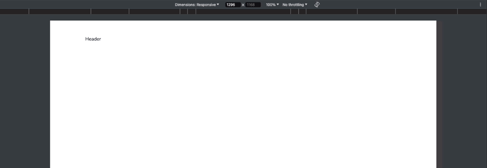
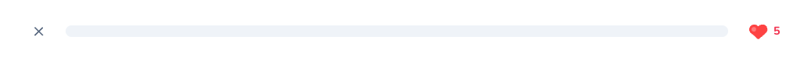

# 16 Lesson Header

## Table of Contents
- [Lesson Page - `app/lesson/page.tsx`](#lesson-page---applessonpagetsx)
- [Important! Setting the Layout](#important-setting-the-layout)
- [`Quiz` Component](#quiz-component)
    - [Building the Component](#building-the-component)
- [`Header` Component](#header-component)
    - [Building the Header](#building-the-header)


We'll be working on a new route, "/lesson." Thus, a new route directory is needed called **`lesson/`**. As per custom, a `page.tsx` is needed and will be as follows:

#### Lesson Page - `app/lesson/page.tsx`

```tsx
import { getLesson, getUserProgress } from "@/db/queries";
import { redirect } from "next/navigation";

const LessonPage = async () => {
    const lessonData = getLesson();
    const userProgressData = getUserProgress();
    
    const [
        lesson,
        userProgress,
    ] = await Promise.all([
        lessonData,
        userProgressData,
    ]);
    
    if (!lesson || !userProgress) {
        redirect("/learn");
    }
    
    const initialPercentage = lesson.challenges
        .filter((challenge) => challenge.completed)
        .length / lesson.challenges.length * 100;
    
    return (
        <div>
            Lesson Page
        </div>
    );
}

export default LessonPage;
```

* With the Lesson Page now existing, the **404 Error** page should no longer exist and will instead display the text "Lesson Page."

* The Lesson Page will be an asynchronous function as it will contain a Promise ensuring that the properties passed exist for that lesson entity before allowing access to the lesson content. Otherwise, it will redirect to the Learn Page.

* Percentage logic will also be implemented for tracking the lesson progress later. For this to be utilized, a custom component called `<Quiz />` will be needed, which will pass this data as a property later on.

### Important! Setting the Layout

Because this will be a completely new page from what was being worked on, the `lesson/` route directory will have its own `layout.tsx` with the following setup:

#### `lesson/layout.tsx`

```tsx
type Props = {
    children: React.ReactNode;
};

const LessonLayout = ({ children }: Props) => {
    return (
        <div className="flex flex-col h-full">
            <div className="flex flex-col h-full w-full">
                {children}
            </div>
        </div>
    );
}

export default LessonLayout;
```

Now the content should dynamically render the lesson content (aka `{children}`) regardless of screen size.

<div align="center">

</div>

## `Quiz` Component

In the `return` statement, we'll create a self-closing `<Quiz />` component with the following properties to pass:

#### `page.tsx`

```tsx
return (
    <Quiz
        initialLessonId={lesson.id}
        initialLessonChallenges={lesson.challenges}
        initialHearts={userProgress.hearts}
        initialPercentage={initialPercentage}
        userSubscription={null}
    />
)
```

Due to the `<Quiz />` component being a client component, the props above will be served as initial data that will later be modified to go into **state** (i.e., hearts), hence becoming changeable.

### Building the Component

Within the `lesson/` folder, create the **`quiz.tsx`** file with the following setup:

#### `quiz.tsx`

```tsx
"use client";

import { challengeOptions, challenges } from "@/db/schema";

type Props = {
    initialPercentage: number;
    initialHearts: number;
    initialLessonId: number;
    initialLessonChallenges: (typeof challenges.$inferSelect & {
        completed: boolean;
        challengeOptions: typeof challengeOptions.$inferSelect[];
    })[];
    userSubscription: any; // TODO: Replace with subscription DB type.
};

export const Quiz = ({
    initialPercentage,
    initialHearts,
    initialLessonId,
    initialLessonChallenges,
    userSubscription,
}: Props) => {
    return (
        <div>Quiz Content</div>
    );
};
```

After attempting to import this component to the `page.tsx` a TypeError may surface for the property `initialLessonChallenges`. Resolve this by wrapping the first `typeof` expression of this property to infer that the entire thing is an array.

Now we can proceed to building the Lesson Header, the prime objective of this segment.

## `Header` Component

Surrounded by fragments (`<>` and `</>`), another component will be created in the `<Quiz />` component, **`<Header />`,** which will contain the following properties:

#### `quiz.tsx`

```tsx
return (
    <>
        <Header
            hearts={hearts}
            percentage={percentage}
            hasActiveSubscription={!!userSubscription?.isActive}
        />
    </>
);
```

Errors may be triggered for the properties `hearts` and `percentage`, but this can be easily resolved by storing them with **`useState`**. Import this and define these values above the return statement:

```tsx
const [hearts, setHearts] = useState(initialHearts);
const [percentage, setPercentage] = useState(initialPercentage);
```

### Building the Header

In the same directory, create a `header.tsx` just like the `quiz.tsx`. This is styled similarly to the market page where the margins will not expand beyond a certain point.

#### `header.tsx`

```tsx
type Props = {
    hearts: number;
    percentage: number;
    hasActiveSubscription: boolean;
};

export const Header = ({
    hearts,
    percentage,
    hasActiveSubscription,
}: Props) => {
    return (
        <header className="lg:pt-[50px] pt-[20px] px-10 flex gap-x-7 items-center justify-between max-w-[1140px] mx-auto w-full">
            Header
        </header>
    );
};
```

This is where the Lesson Header becomes more complex. Within the `<header>` tag, the following will be customized and imported:

```tsx
import Image from "next/image";
import { InfinityIcon, X } from "lucide-react";

import { Progress } from "@/components/ui/progress";

type Props = {/* ...omitted for brevity */};

export const Header = ({/* ...omitted */}: Props) => {
    return (
        <header className="lg:pt-[50px] pt-[20px] px-10 flex gap-x-7 items-center justify-between max-w-[1140px] mx-auto w-full">
            <X
                onClick={() => {}} // TODO: Add onClick exit
                className="text-slate-500 hover:opacity-75 transition cursor-pointer"
            />
            <Progress value={percentage} />
            <div className="text-rose-500 flex items-center font-bold">
                <Image
                    src="/heart.svg"
                    height={28}
                    width={28}
                    alt="Heart"
                    className="mr-2"
                />
                { hasActiveSubscription
                    ? <InfinityIcon className="h-6 w-6 stroke-[3]" />
                    : hearts
                }
            </div>
        </header>
    );
};
```

* The `<X>` component creates an interactive "X" for users to quit the current lesson session.
* Beside it is the progress bar, which needs to be imported by a **shadcn** package. This can be installed via the command in a separate terminal:
    ```bash
    npx shadcn-ui@latest add progress
    ✔ Done.
    ```

* Then we'll have the hearts to let the user know how many remaining attempts they have left. Additional styling was made by changing the state in the `<Quiz />` component:
    ```tsx
    const [hearts, setHearts] = useState(50 || initialHearts); // shows 50 hearts
    const [percentage, setPercentage] = useState(initialPercentage); // marks 50% of progress bar
    ```
    In this case, the progress bar did not have the appropriate color. To fix this, access the `progress.tsx` UI component by navigating to the `components/ui` directory in the project's main root folder. Under the `<ProgressPrimitive.Indicator>` tag, change the color from `primary` to `bg-green-500`:
    ```tsx
    <ProgressPrimitive.Indicator
        className="h-full w-full flex-1 bg-green-500 transition-all"
        style={{ transform: `translateX(-${100 - (value || 0)}%)` }}
        />
    </ProgressPrimitive.Root>
    ```

After all this is done, the changes to the state in the `<Quiz />` component can be reverted, and the final look of the progress bar for this segment is shown below:

<div align="center">

</div>