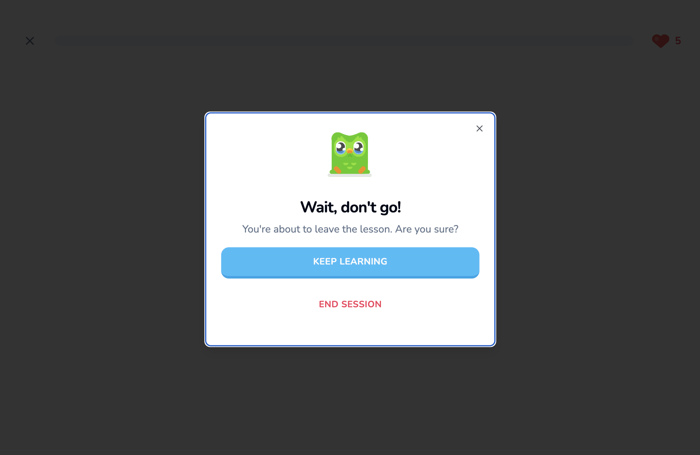

# 17 Exit Modal

For this section, we want to create an exit modal that appears upon clicking the "X" to leave the lesson. To start, let's install some packages.

## Table of Contents
- [Preinstalling Packages](#preinstalling-packages)
- [1. The Modal State](#1-the-modal-state)
- [2. The Component](#2-the-component)
    - [Imports](#imports)
    - [Setting the Mounts](#setting-the-mounts)
    - [Final Touch](#final-touch)

## Preinstalling Packages

Install the following packages in a separate terminal:

```bash
npx shadcn-ui@latest add dialog
npm i zustand
```

Add another SVG to our `public/` folder called "`mascot_sad.svg`".


## 1. The Modal State

Let's create the hook using the newly installed `zustand` package. In the root project folder (`lingo/`), create a new folder called **`store/`** with a file called **`use-exit-modal.ts`**. The setup is this:

#### `use-exit-modal.ts`

```ts
import { create } from "zustand";

type ExitModalState = {
    isOpen: boolean;
    open: () => void;
    close: () => void;
}

export const useExitModal = create<ExitModalState>((set) => ({
    isOpen: false,
    open: () => set({ isOpen: true }),
    close: () => set({ isOpen: false }),
}));
```

## 2. The Component

### Imports

Go to the `components/` directory and create a new folder called **`modals/`**. Then create the file **`exit-modal.tsx`**. It will contain the following imports:

#### `exit-modal.tsx`

```tsx
"use client"

import Image from "next/image";
import { useRouter } from "next/navigation";
import { useEffect, useState } from "react";

import {
    Dialog,
    DialogContent,
    DialogDescription,
    DialogFooter,
    DialogHeader,
    DialogTitle,
} from "@/components/ui/dialog";
import { Button } from "@/components/ui/button";
import { useExitModal } from "@/store/use-exit-modal";

export const ExitModal = () => {
    /* ... */
};
```

### Setting the Mounts

Let's define the states upon mount and check if this component has turned into a "client component". If not, then the `useEffect` will not run as that would only occur on the client side:

```tsx
// ... imports

export const ExitModal = () => {
    
    const router = useRouter();
    const [isClient, setIsClient] = useState(false);
    const { isOpen, close } = useExitModal();
    
    useEffect(() => setIsClient(true), []);
    
    if (!isClient) {
        return null;
    }
};
```

Let's render the component. First, go to the `app/` directory's `layout.tsx` file and under the `<Toaster/>` component, import the `<ExitModal>` component that we're building:

#### `app/layout.tsx`

```tsx
import type { Metadata } from "next";
import { Nunito } from "next/font/google";
import { ClerkProvider } from '@clerk/nextjs'
import { Toaster } from "@/components/ui/sonner"
import "./globals.css";
import { ExitModal } from "@/components/modals/exit-modal";

const font = Nunito({ subsets: ["latin"] });

export const metadata: Metadata = {
  title: "Create Next App",
  description: "Generated by create next app",
};

export default function RootLayout({
  children,
}: Readonly<{
  children: React.ReactNode;
}>) {
  return (
    <ClerkProvider>
      <html lang="en">
        <body className={font.className}>
          <Toaster />
          <ExitModal />
          {children}
        </body>
      </html>
    </ClerkProvider>
  );
}
```

Revisit the Exit Modal hook and set `isOpen` to `true`. This is a good technique to check if what we're developing is working properly:

#### `store/use-exit-modal.ts`

```ts
export const useExitModal = create<ExitModalState>((set) => ({
    isOpen: true, // TODO: Change back to false
    /* ... */
}));
```

Now going back to the `ExitModal` component, let's render the Dialog:

```tsx
return (
    <Dialog open={isOpen} onOpenChange={close}>
        <DialogContent className="max-w-md">
            <DialogHeader>
                <div className="flex items-center w-full justify-center mb-5">
                    <Image
                        src="/mascot_sad.svg"
                        alt="Mascot"
                        height={80}
                        width={80}
                    />
                </div>
                <DialogTitle className="text-center font-bold text-2xl">
                    Wait, don&apos;t go!
                </DialogTitle>
                <DialogDescription className="text-center text-base">
                    You&apos;re about to leave the lesson. Are you sure?
                </DialogDescription>
            </DialogHeader>
            <DialogFooter className="mb-4">
                <div className="flex flex-col gap-y-4 w-full">
                    <Button
                        variant="primary"
                        className="w-full"
                        size="lg" 
                        onClick={close}
                    >
                        Keep Learning
                    </Button>
                    <Button
                        variant="dangerOutline"
                        className="w-full"
                        size="lg" 
                        onClick={() => {
                            close();
                            router.push("/learn");
                        }}
                    >
                        End Session
                    </Button>
                </div>
            </DialogFooter>
        </DialogContent>
    </Dialog>
);
```

### Final Touch

The finishing look is this:

<div align="center">

</div>

We can go back and revert this Exit Modal's state:

#### `store/use-exit-modal.ts`

```ts
export const useExitModal = create<ExitModalState>((set) => ({
    isOpen: false,
    /* ... */
}));
```

Now we'll go back to the Lesson Header and link the **Exit Modal** action to the `onClick` property of the `<X>` component.

#### `lesson/header.tsx`

```tsx
// ... other imports
import { useExitModal } from "@/store/use-exit-modal";

export const Header = ({/*...*/}: Props) => {
    const { open } = useExitModal();
    return (
        <header> 
            <X // Replace onClick={() => {}} with...
                onClick={open} // NEW!
            />
            {/*...*/}
        </header> 
    );
}
```

Because the Lesson Header is already part of an even bigger "client" component, it would be unnecessary to define `use client` in the Lesson Header just to make the mount work here.

The Exit Modal in the Lesson Page should now respond appropriately upon user click — "Keep Learning" to resume the session and "End Session" to redirect to the Learn Page.

The next section will focus on creating challenge cards.
