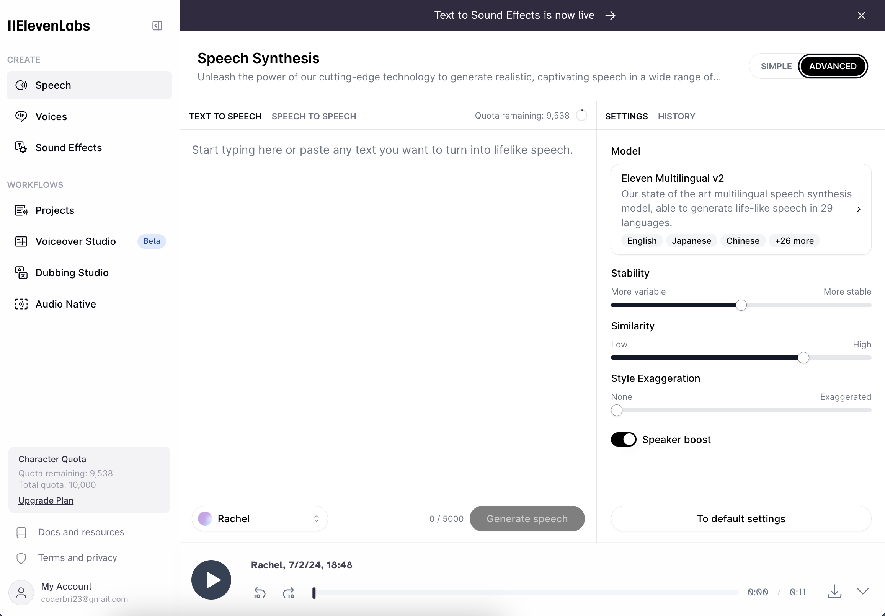
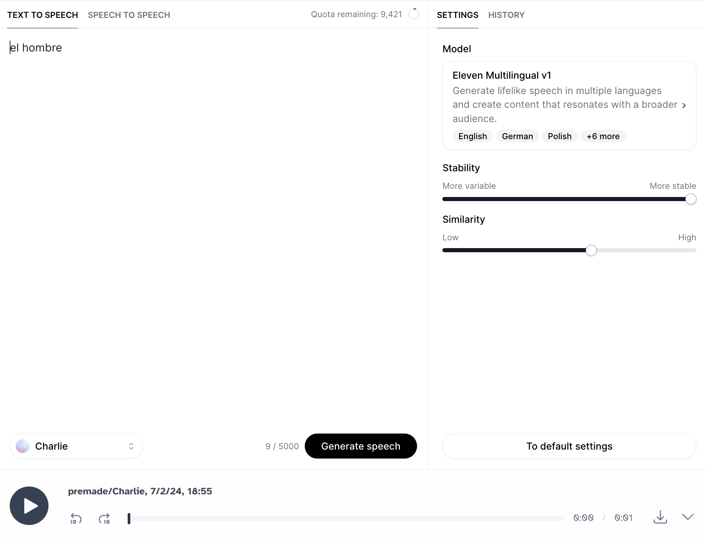
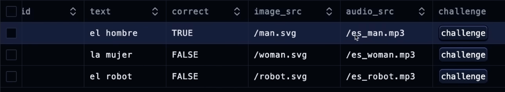

# 18.5 Challenge Card - AI Audio

This next section will focus on creating the logic so that when the user clicks on an individual element of a card, the first thing that will happen is the audio playing to pronounce what is written in the text of the challenge option. To achieve this, we’ll need to use 11ElevenLabs AI to generate voices in different languages.

## Table of Contents

- [Getting Started with 11 Labs](#getting-started-with-11-labs)
- [Configuring Audio to the `Card` Component](#configuring-audio-to-the-card-component)
- [Adding Visual Cue for Selected Option](#adding-visual-cue-for-selected-option)

## Getting Started with 11 Labs

Go to the website for **[11ElevenLabs](https://elevenlabs.io/)** and create an account. After signing in, this is the page we should land on:

<div align="center">

</div>

After configuring the voices to our liking, we can start inputting vocabulary in the Text Area to generate speech. For our first speech generation, we’ll do “*el hombre*”. The configurations are as follows:

<div align="center">

</div>

If the audio sounds to your liking, then proceed to download it. We’re going to store this file in the `public/` directory and rename it with the prefix of the language and then the vocabulary it's for (i.e., **es_man.mp3**). Subfolders for the audio files will not be needed.

Now we’re going to navigate to our Drizzle Studio, populated by the terminal command `db:studio`, and ensure that this audio file for “*el hombre*” is correctly named as it is in the `challenge_options` table.

<div align="center">

</div>

Seeing this, we can now go back to 11ElevenLabs and continue making the audio files for the other challenge options: *la mujer* and *el robot*. At this point in the project, only these three will suffice.

## Configuring Audio to the `Card` Component

Now we’re going to shut down Drizzle Studio and, in the same terminal, install a new package:

```bash
npm i react-use
```

This is a collection of packages we’ll need for this upcoming step.

Renavigating back to the last place we left off, the `Card` component file of the **`lessons/`** route directory, we’re going straight to the first `<div>` which contains an `onClick` function and create a method for it.

#### `card.tsx`

```tsx
const handleClick = useCallback(() => {
	if (disabled) return;
	
}, [disabled, onClick]);
```

- The method `useCallback()` from the React library will serve as a dependency in one of the event listeners from the newly installed use hooks.
- If this method is disabled, exit it.
- The dependency array will take in the `disabled` and `onClick` properties.
- We want to be able to import audio to the challenge options using “react-use”. We’ll start with the imports `useAudio` and `useKey`.
  - We’ll then destructure an array from `useAudio` with a property of `src` for `audioSrc` or an empty string if no audio is provided.
    ```tsx
    const [] = useAudio({ src: audioSrc || "" });
    const handleClick = useCallback(() => {/*...*/}, [disabled, onClick]);
    ```
  - This destructured array requires certain arguments, but we don’t have anything for the second argument (which is HTML Media State). So to go around it, we’ll set it up as such:
    ```tsx
    const [audio, _, controls] = useAudio({ src: audioSrc || "" });
    ```
  - `controls` is needed for the playback controls like play, pause, seek, volume, mute, and unmute. 
  - `audio` is needed as this is the React element that is rendered in the app. It can be placed anywhere, but for the sake of it being near the other challenge option’s attributes, we’ll place it above the `{imageSrc}` code we rendered earlier in the project. This is invisible and will not affect the other elements in any way. We can go back to the `handleClick` method and add `controls.play()`:
    ```tsx
    const handleClick = useCallback(() => {
        if (disabled) return;
        
        controls.play()
        onClick();
    }, [disabled, onClick, controls]);
    ```
- Now we’ll add `controls` as a parameter in the `handleClick` dependency array and then create a `useKey()` event listener below this method which takes in the property of shortcut, so that users may use their keyboard to select a challenge option and maps to the "react-use" packages imported. We’ll want this event listener to take in a shortcut so that it can execute the `handleClick` method, take in empty options, and finally a dependency array with `handleClick`.
  ```tsx
  /* handleClick */
  useKey(shortcut, handleClick, {}, [handleClick]);
  ```

We can now go back to the return statement, in the `<div>` with the empty `onClick` function and replace it with the newly created method `handleClick`. The `audioSrc` we generated for the challenge options should now play when pressing down its respective key.

## Adding Visual Cue for Selected Option

We still have a problem, however—there is no visual indicator for users to see the option they selected. This traces back to the `onSelect` property, so let’s backtrack a bit here:
1. From the `Card` component file’s `handleClick` method, it plays the audio from `controls` before executing the `onClick()` property.
2. The `onClick` property is what we set up for the `<Card />` component import in the **`Challenge`** component’s file. This property is a function that calls `onSelect` with the challenge option’s `id`.
3. The `onSelect` then traces back to the `<Challenge/>` component’s import of the `Quiz` component file where it contains a property of `onSelect` but with an empty arrow function.

Now that we found the source of the problem, let’s fix it. In the `Quiz` component’s file, create another state right under the `useState` for `activeIndex`. This will represent the selected option with a data type of *number*:

#### `quiz.tsx`

```tsx
const [selectedOption, setSelectedOption] = useState<number>();
```

Create another `useState` for the `selectedOption`’s status that is by default “none” but can become any of the states defined below:
```tsx
const [status, setStatus] = useState<"correct" | "wrong" | "none">("none");
```

Then we are going to set up an `onSelect` function under the `options` constant:
```tsx
const onSelect = (id: number) => {
	if (status !== "none") return;
	setSelectedOption(id);
};
```
- By status = “none” we mean that the user has not submitted their choice, therefore still being able to select a challenge option. But if the user has already submitted a choice, then its state will be either "correct" or "wrong,” hence being unchangeable.

We can now go to the return statement where we’re rendering the `<Challenge/>` component of the `Quiz` component file, and update the props as follows:
```tsx
return (
	<Challenge
		// other props remain the same
		onSelect={onSelect}
		status={status}
		selectedOption={selectedOption}
	/>
);
```

Finally, the challenge options can now be selected both visually and audibly.
