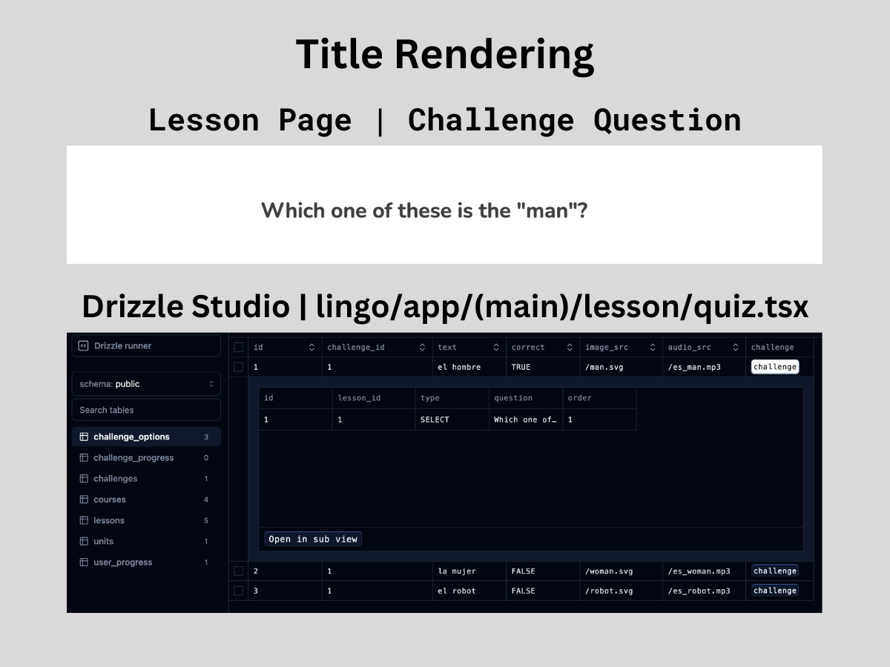

# 18 Challenge Cards

Returning to the `Quiz` Component of the `lesson/` route directory, we're going to continue building the Lesson Page with the challenge content below the header.

## Table of Contents

- [Setting Up the Challenge Question](#setting-up-the-challenge-question)
    - [Debugging if Challenge Question is Not Appearing](#debugging-if-challenge-question-is-not-appearing)
- [Challenge Component 2: Main Interactivity](#challenge-component-2-main-interactivity)
    - [`Card` Component: Main `<div>`](#card-component-main-div)
    - [`Card` Component: Content](#card-component-content)

## Setting Up the Challenge Question

First, we will add a new `<div>` right below the header to define the dimensions and host the title question of the challenge:

#### `quiz.tsx`

```tsx
return (
    <>
        <Header {/* ... */} />
        <div className="flex-1">
            <div className="h-full flex items-center justify-center">
                <div className="lg:min-h-[350px] lg:w-[600px] w-full px-6 lg:px-0 flex flex-col gap-y-12">
                    <h1 className="text-lg lg:text-3xl text-center lg:text-start font-bold text-neutral-700">
                        Which of these is an apple?
                    </h1>
                    <div>
                        {/* TODO: Challenge Component */}
                    </div>
                </div>
            </div>
        </div>
    </>
)
```

The hardcoded question here needs to be replaced with the actual challenge's question for the lesson. We will use `useState` to store the challenge data, which will be useful when developing the `<Challenge/>` component.

Underneath the other `useState` variables, we will create the following states to retrieve the active challenge the user is currently on:

```tsx
// ...omitted code for brevity
const [challenges] = useState(initialLessonChallenges);

const [activeIndex, setActiveIndex] = useState(() => {
    const uncompletedIndex = challenges.findIndex((challenge) => !challenge.completed);
    return uncompletedIndex === -1 ? 0 : uncompletedIndex;
});

const challenge = challenges[activeIndex]; // or challenges[0]
```

We need to retrieve the challenge based on its type. To do this, we'll create a state that can find the current challenge via its **active index** so the user can navigate to that challenge.

After finding the user's current lesson, we will organize the challenge indexes and rule out any invalid values. If the index is -1, it will retrieve the first active challenge (at index 0) or the first uncompleted challenge. This will help the program remember where the user left off instead of resetting their progress. This will be stored in the `challenge` constant variable.

Returning to the `title` constant, we can use the challenge variable we created to retrieve the challenge type and present the appropriate question based on the prop's type:

```tsx
// challenge.type (property) type: "SELECT" | "ASSIST"
const title = challenge.type === "ASSIST"
    ? "Select the correct meaning"
    : challenge.question;
```

We want to set up the challenge so that if it is `"ASSIST"`, the user selects the correct option. Otherwise, for the `"SELECT"` type of question, the _`title`_ will present the proper question from the schema.

Now we can render the `{title}` instead of the hardcoded title:

```tsx
return (
    <>
        {/* ... */}
        <h1 className="text-lg lg:text-3xl text-center lg:text-start font-bold text-neutral-700">
            {title}
        </h1>
        {/* ... */}
    </>
)
```

We can confirm if this is rendering properly by checking Drizzle Studio in the terminal we designated for running the command `db:studio`.

<div align="center">

</div>

### Debugging if Challenge Question is Not Appearing

If for any reason the challenge question is not rendering from the database, we need to trace back to the source.

1. The variable we are using to access the challenge data is the `useState` for **`initialLessonChallenges`** in the Quiz Component.
2. Go to the Lesson Page and confirm that we are using the correct query method `getLesson()`. Based on the `db/queries.ts` file, this should load lessons using the `.findFirst()` query, which will load the current lesson with its respective challenges.
3. This comes into play in the `Quiz` Component's `initialLessonChallenges` prop (within the `lesson/page.tsx` file) that takes in the lesson data as `{lesson.challenges}`.
4. Returning to the `Quiz.tsx`, we go to our next `useState` for **`activeIndex`** so that the `challenges` constant can retrieve the active lesson based on that index and that index's challenges.
5. Finally, this is how we can render the question properly for the title.

### Challenge Component 1: Question Bubble

For this section, we will create a component for question bubbles. This will only work for questions of type `"SELECT"`. For testing purposes, we’ll change the challenge type from `"ASSIST"` to `"SELECT"` to allow rendering for the **`<QuestionBubble/>`** Component:

#### `quiz.tsx`

```tsx
return (
    {/* ... */}
    <div>
        {/* TODO: Change back to type "ASSIST" */}
        {challenge.type === "SELECT" && (
            <QuestionBubble
                question={challenge.question}
            />
        )}
    </div>
)
```

Now we can go on to create the **`QuestionBubble`** Component in the `lesson/` route directory. The initial setup is:

#### `question-bubble.tsx`

```tsx
import Image from "next/image"

type Props = {
    question: string;
};

export const QuestionBubble = ({ question }: Props) => {
    return (
        <div>
            Question Bubble
        </div>
    );
};
```

This is enough to go back to the `Quiz` Component to import `QuestionBubble` to eliminate any errors. If nothing shows up, change the `challenge.type` to `"SELECT"` instead of `"ASSIST"` right before where the component is rendered, and we should now see the text "Question Bubble". For now, we will leave it as `"SELECT"` to be able to track the rendering for this challenge type.

Let's style `question-bubble.tsx`:

```tsx
return (
    <div className="flex items-center gap-x-4 mb-6">
        <Image
            src="/mascot.svg"
            alt="Mascot"
            height={60}
            width={60}
            className="hidden lg:block"
        />
        <Image
            src="/mascot.svg"
            alt="Mascot"
            height={40}
            width={40}
            className="block lg:hidden"
        />
        <div className="relative py-2 px-4 border-2 rounded-xl text-sm lg:text-base">
            {question}
            <div
                className="absolute -left-3 top-1/2 w-0 border-x-8 border-x-transparent border-t-8 transform -translate-y-1/2 rotate-90"
            />
        </div>
    </div>
);
```

The self-closing `<div/>` is a little chevron that makes the question bubble next to the mascot appear as if it is speaking.

<div align="center">

</div>

For now, we'll put the challenge question as a placeholder in the `title` constant in this question bubble and deal with it later.

That is all for the `QuestionBubble` Component, so we can now go back to the `quiz.tsx` and change back the challenge type for the `QuestionBubble` Component to `"ASSIST"`.


Sure, here is the grammatically checked and slightly refined version of the next section of your notes:


## Challenge Component 2: Main Interactivity

This ****`Challenge`**** component will take in a prop of `options` which needs to be derived from the current challenge. To achieve this, we'll need another variable called `options` and will use the `challenge` constant to retrieve the challenge options, if any.

```tsx
const challenge = challenges[activeIndex];
const options = challenge?.challengeOptions;
```

The `<Challenge/>` component will be rendered after the code that renders `QuestionBubble` and will contain the following props needed for its own component file:

#### `quiz.tsx`

```tsx
return (
    <>
        {/* ... */}
        <div>
            <Challenge
                options={options}
                onSelect={() => {}}
                status="Correct"
                selectedOption={null}
                disabled={false}
                type={challenge.type}
            />
        </div>
        {/* ... */}
    </>
);
```

#### `challenge.tsx`

```tsx
import { challengeOptions, challenges } from "@/db/schema";
import { cn } from "@/lib/utils";

type Props = {
    options: typeof challengeOptions.$inferSelect[];
    onSelect: (id: number) => void;
    status: "correct" | "wrong" | "none";
    selectedOption?: number;
    disabled?: boolean;
    type: typeof challenges.$inferSelect["type"];
};

export const Challenge = ({
    options,
    onSelect,
    status,
    selectedOption,
    disabled,
    type,
}: Props) => {
    return (
        <div className={cn(
            "grid gap-2",
            type === "ASSIST" && "grid-cols-1",
            type === "SELECT" && "grid-cols-2 lg:grid-cols-[repeat(auto-fit, minmax(0,1fr))]"
        )}>
            {options.map((option, i) => (
                <div key={option.id}>
                    {JSON.stringify(option)}
                </div>
            ))}
        </div>
    );
};
```

- For the first `<div>`, we’ll import the `cn` library as this class will be dynamically rendered depending on the challenge type. It will contain the default render before it's conditionally rendered.
- We’ll first check if the `challengeOptions` render with `JSON.stringify()` before creating a component to host this data.

<div align="center">

</div>

After successfully rendering the `challengeOptions`, we can now render a `<Card/>` component with the following properties:

```tsx
return (
    <>
    <div>
        {options.map((option, i) => (
            <div key={option.id}>
                <Card
                    id={option.id}
                    text={option.text}
                    imageSrc={option.imageSrc}
                    shortcut={`${i + 1}`}
                    selected={selectedOption === option.id}
                    onClick={() => onSelect(option.id)}
                    status={status}
                    audioSrc={option.audioSrc}
                    disabled={disabled}
                    type={type}
                />
            </div>
        ))}
    </div>
    </>
)
```

- **About the `shortcut` property**: this will enable the user to pick an option using their keyboard.

Now we can create our final nested component for this Challenge Card section.

### `Card` Component: Main `<div>`

This component is specific only to the Lesson Page, so it will be created in the `lesson/` route directory as **`card.tsx`**. It is set up as such:

#### `card.tsx`

```tsx
import Image from "next/image";

import { cn } from "@/lib/utils";
import { challenges } from "@/db/schema";

type Props = {
    id: number;
    imageSrc: string | null;
    audioSrc: string | null;
    text: string;
    shortcut: string;
    selected?: boolean
    onClick: () => void;
    disabled?: boolean;
    status?: "correct" | "wrong" | "none";
    type: typeof challenges.$inferSelect["type"];
};

export const Card = ({
    id, imageSrc, audioSrc, text, shortcut, selected, onClick, disabled, status, type
}: Props) => {
    return (
        <div>
            Card
        </div>
    );
};
```

- Three “Card” options should show up, perfectly representing the three challenge options we set up in our Seed Script. So we can now start styling to render the data correctly.

The first `<div>` is the `Card` component itself. This styling is rather complex as it will be dynamically rendered based on if the option is selected, “correct” or “wrong”, or disabled.

1. To simulate the options’ color, go to `quiz.tsx` and set the `<Challenge>` component’s `status` property from `"none"` to `"correct"`. Then go to `challenge.tsx` and change the `<Card>` component’s `selected` property:
   ```tsx
   // quiz.tsx: From status="none"
   status="correct"
   // challenge.tsx: From selected={selectedOption === option.id} to
   selected={true || selectedOption === option.id}
   ```
    <div align="center">
    
    </div>

2. To simulate that the options are wrong, simply change the `status` property to "wrong":
    <div align="center">
    
    </div>

3. Finally, to see how the option would look if it's simply selected, set the `status` to "none":
    <div align="center">
    
    </div>

Now we can work with contents inside the `Card`: Image and text.

### `Card` Component: Content

Before writing the code, import to the `public/` directory the required image SVGs to present the challenge options for this section: the man, woman, and robot.

If an image is provided for the challenge option, we can set it up here to display:

```tsx
return (
    <div>
        {/* ... */}
        {imageSrc && (
            <div className="relative aspect-square mb-4 max-h-[80px] lg:max-h-[150px] w-full">
                <Image src={imageSrc} fill alt={text} />
            </div>
        )}
        {/* ... */}
    </div>
);
```

To ensure that items are properly placed within the `Card`, we’ll add this snippet of code after the `imageSrc` conditional statement:
```tsx
return (
    <div>
        {/* ... */}
        <div className={cn(
            "flex items-center justify-between",
            type === "ASSIST" && "flex-row-reverse",
        )}>
            {type === "ASSIST" && <div />}
            {/* ... */}
        </div>
    </div>
);
```

After this snippet, we’ll now render the text that names each of these options along with its respective keyboard shortcut:

```tsx
return (
    <div>
        {/* ... */}
        <div className={cn(/*...*/)}>
            {/* ... */}
            <p className={cn(
                "text-neutral-600 text-sm lg:text-base",
                selected && "text-sky-500",
                selected && status === "correct"
                    && "text-green-500",
                selected && status === "wrong"
                    && "text-rose-500",
            )}>
                {text}
            </p>
            <div className={cn(
                "lg:w-[30px] lg:h-[30px] h-[20px] border-2 flex items-center justify-center rounded-lg text-neutral-400 lg:text-[15px] text-xs font-semibold",
                selected && "border-sky-300 text-sky-500",
                selected && status === "correct"
                    && "border-green-500 text-green-500",
                selected && status === "wrong"
                    && "border-rose-500 text-rose-500",
            )}>
                {shortcut}
            </div>
        </div>
    </div>
);
```

- For rendering the challenge options’ text and keyboard shortcut, we’ll apply similar rendering to them as we did to the main `<div>` where its `selected` color will match the `status` of the answer.

The final look of the Challenge Cards is this:

<div align="center">

</div>
