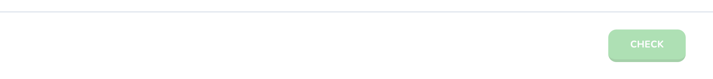
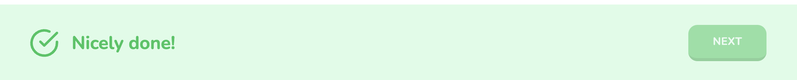
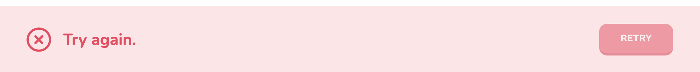
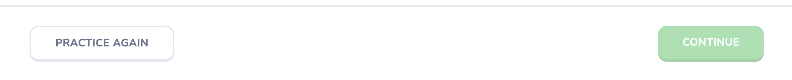

# 19 Challenge Footer

This next section will focus on creating a **Footer** component for confirming the user’s choice. This is the logic needed when selecting the challenge option with the keyboard shortcuts assigned in the previous section as well as a “confirm” option to validate the answers, either to proceed to the next challenge or to reduce a heart if the answer is wrong.

## Table of Contents
- [Setting Up the Footer Component](#setting-up-the-footer-component)
- [Styling the Footer](#styling-the-footer)
    - [Spacing](#spacing)
    - [Button & Functionality](#button--functionality)
- [Testing Footer Status](#testing-footer-status)
- [Conclusion](#conclusion)


## Setting Up the Footer Component

In the `Quiz` component file, where we updated the props of the `<Challenge />` component, we’re going to continue working after the last `<div/>` but before the closing fragment (`</>`) to create the new `<Footer />` component. It will be prepared with the following props:

#### `app/lesson/quiz.tsx`

```tsx
return (
    <Footer
        disabled={!selectedOption}
        status={status}
        onCheck={() => {}}
    />
);
```
- The `disabled` prop will detect if there is no selected option.
- The `status` prop, which was set up in Section 18.5, will rely on the challenge option the user selected and if it is correct or wrong.
- The `onCheck` prop will be set up as an empty arrow function for now until we can work on it later.

Now we can go on to create the **Footer** component file within the `lesson/` route directory. These are the imports, props, and setup we’ll begin with to import the component in `quiz.tsx`:

#### `lesson/footer.tsx`

```tsx
import { useKey, useMedia } from "react-use";
import { CheckCircle, XCircle } from "lucide-react";

import { cn } from "@/lib/utils";
import { Button } from "@/components/ui/button";

type Props = {
    onCheck: () => void;
    status: "correct" | "wrong" | "none" | "completed";
    disabled?: boolean;
    lessonId?: boolean;
};

export const Footer = ({
    onCheck,
    status,
    disabled,
    lessonId
}: Props) => {
    return (
        <footer>
        </footer>
    );
};
```

About the props:
- As mentioned earlier, the `onCheck` prop will remain *void* for now.
- For the `status` prop, it will contain four options: “correct”, “wrong”, “none” and the new attribute, “completed”. This will be needed for the Footer component to detect that the entire lesson has been completed.
- Both the `disabled?` and `lessonId?` props will be set as a boolean if they exist.

This will be enough to import the component. We can return to `footer.tsx` and begin styling it.


## Styling the Footer

### Spacing

We’ll begin with defining the `<footer>` tag’s colors to render dynamically based on the challenge option’s status. Then we’ll style the `<div>` within to render with the same spacing as the progress bar at the top of the screen.

```tsx
return (
	<footer className={cn(
		"lg:h-[140px] h-[100px] border-t-2",
		status === "correct" && "border-transparent bg-green-100",
		status === "wrong" && "border-transparent bg-rose-100",
	)}>
		<div className="max-w-[1140px] h-full mx-auto flex items-center justify-between px-6 lg:px-10">
		</div>
	</footer>
);
```


### Button & Functionality

Now within this `<div>`, a **Button** component will be rendered here with various messages depending on the status of the challenge option. It will also contain the following properties to render properly:

```tsx
export const Footer = ({/*...*/}: Props) => {
	const isMobile = useMedia("(max-width: 1024px)");
	
	return (
		<footer>
			<div>
				<Button
					disabled={disabled}
					className="ml-auto"
					onClick={onCheck}
					size={isMobile ? "sm" : "lg"}
					variant={status === "wrong" ? "danger" : "secondary"}
				>
					{status === "none" && "Check"}
					{status === "correct" && "Next"}
					{status === "wrong" && "Retry"}
					{status === "completed" && "Continue"}
				<Button>
			</div>
		</footer>
	);
};
```
About the **Button**’s props:
* This **Button** will always be rendered disabled when a challenge appears unless an option is selected.
* Being set to "ml-auto" will position the **Button** to the right of the screen.
* The `onClick` prop will be dependent on the `onCheck` prop defined earlier.
* We will also define a `size` prop versus styling it in a class because we want the Button to be dynamically rendered with the **useMedia** import from "react-use" to determine if this button is being rendered in mobile. This will require a `const isMobile` with a ternary statement of size options before the return statement.
* Finally, the `variant` prop is dependent on the `status` of the option.

Within `<Button>`, there will be a ternary to check the status of the option so that the proper message can be rendered accordingly. As only one status can exist at a time, we can have the ternary operators defined separately. 

Now we want to gamify the experience by using the **useKey** import from "react-use" so when the user clicks the Return/Enter key, the challenge option is submitted.

```tsx
export const Footer = ({/*...*/}: Props) => {
	useKey("Enter", onCheck, {}, [onCheck]);
	const isMobile = useMedia("(max-width: 1024px)");
	return (
		<footer>
			{/*...*/}
		</footer>
	);
};
```


## Testing Footer Status

Now we want to simulate the footer based on different statuses. To do this, we’ll add this segment of code underneath the first `<div>`:

```tsx
return (
	<footer>
		<div>
			{status === "correct" && (
				<div className="text-green-500 font-bold text-base lg:text-2xl flex items-center">
					<CheckCircle className="h-6 w-6 lg:h-10 lg:w-10 mr-4" />
						Nicely done!
				</div>
			)}
			{status === "wrong" && (
				<div className="text-rose-500 font-bold text-base lg:text-2xl flex items-center">
					<XCircle className="h-6 w-6 lg:h-10 lg:w-10 mr-4" />
						Try again.
				</div>
			)}
			{status === "completed" && (
				<Button
					variant="default"
					size={isMobile ? "sm" : "lg"}
					onClick={() => window.location.href = `/lesson/${lessonId}`}
				>
					Practice again
				</Button>
			)}
		</div>
	</footer>
);
```

To confirm this is displayed as intended, navigate to the **`Quiz`** component and configure the useState for status. In the parenthesis, set the useState to "correct" and "wrong" accordingly:

### `lesson/quiz.tsx`

#### Default Status:

```tsx
const [status, setStatus] = useState<"correct" | "wrong" | "none">("none");
```

<div align="center">

</div>


#### Correct Status:

```tsx
const [status, setStatus] = useState<"correct" | "wrong" | "none">("correct");
```

<div align="center">

</div>


#### Wrong Status:

```tsx
const [status, setStatus] = useState<"correct" | "wrong" | "none">("wrong");
```

<div align="center">

</div>


#### Completed Status:

```tsx
const [status, setStatus] = useState<"correct" | "wrong" | "none">("none");
```

Due to the fact that “completed” is not a status that can be selected we’ll access the `<Footer>` component `status` prop and define it there:

```tsx
return (
	<Footer
		disabled={/*...*/}
		status={"completed" || status}
		onCheck={/*...*/}
	/>
);
```

The "Practice again" button should now show up:

<div align="center">

</div>


## Conclusion

The `onCheck` functionality is not yet completed for the Footer component; however, it is now built. The next section will focus on actually marking the challenge as "completed".
