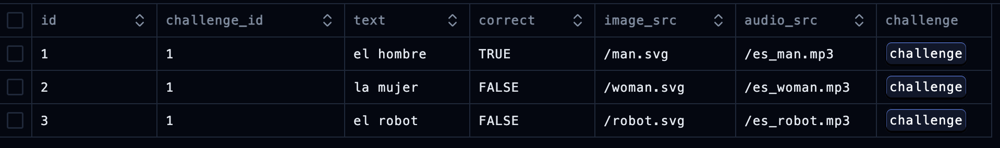
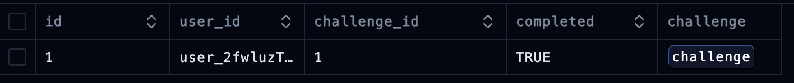
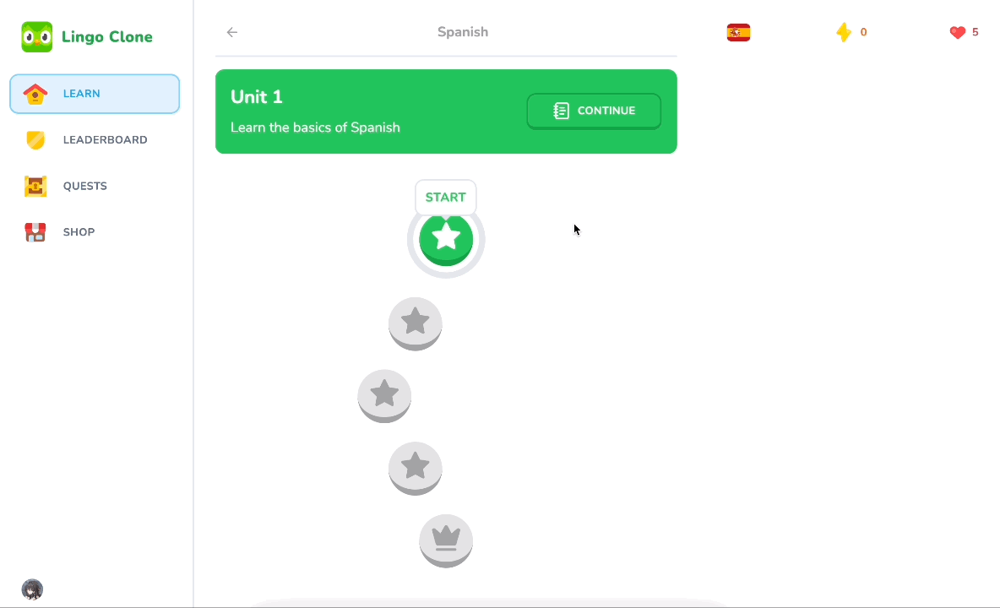
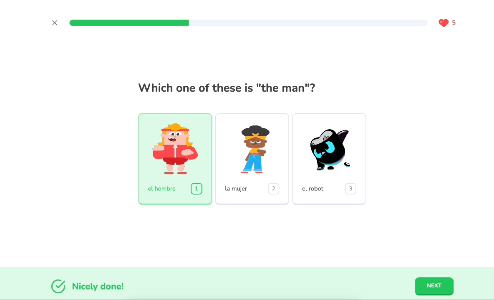
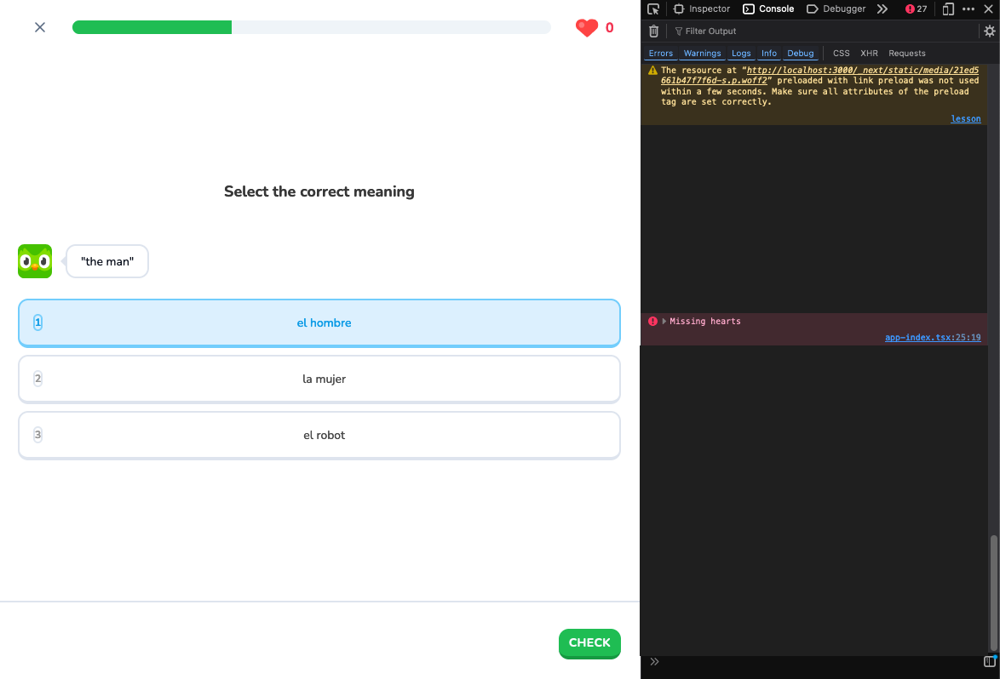

# 20 Challenge Actions

This section focuses on adding the missing functionality from the last section, where the app will provide feedback to the user on whether their choice is correct or incorrect.

We also want to add the ability to mark a challenge as complete. Once a selection is made and the user clicks on the "Check" button, the app will give feedback on whether the choice is correct or incorrect.

## Table of Contents

- [Methods: `onNext` and `onContinue`](#methods-onnext-and-oncontinue)
    - [Method 1: `onNext`](#method-1-onnext)
    - [Method 2: `onContinue`](#method-2-oncontinue)
- [Building the Challenge Actions](#building-the-challenge-actions)
- [Refining the `onContinue` Method: "Correct" Answers](#refining-the-oncontinue-method-correct-answers)
    - [Adding More Challenges](#adding-more-challenges)
    - [Pending State for UI](#pending-state-and-ui)
- [Server Action: Handling Incorrect Answers](#server-action-handling-incorrect-answers)
- [Refining the `onContinue` Method: "Incorrect" Answers](#refining-the-oncontinue-method-incorrect-answers)


## Methods: `onNext` and `onContinue`

### Method 1: `onNext`

Let’s go back to our **Quiz** component in the `lesson/` folder and create a reusable method called **`onNext`** under the `const options`:

#### `app/lesson/quiz.tsx`

```tsx
const onNext = () => {
	setActiveIndex((current) => current + 1);
};
```

* This function will set the active index to the current index (the lesson the user is on), incremented by one.

### Method 2: `onContinue`

Below the line with the `onSelect` constant, create a new method called **`onContinue`**:

```tsx
const onContinue = () => {
    if (!selectedOption) return;

    if (status === "wrong") {
        setStatus("none");
        setSelectedOption(undefined);
        return;
    }

    if (status === "correct") {
        onNext();
        setStatus("none");
        setSelectedOption(undefined);
        return;
    }

    const correctOption = options.find((option) => option.correct);

    if (!correctOption) {
        return;
    }

    if (correctOption && correctOption.id === selectedOption) {
        startTransition(() => {
            upsertChallengeProgress(challenge.id)
                .then((response) => {
                    if (response?.error === "hearts") {
                        console.error("Missing hearts");
                        return;
                    }

                    setStatus("correct");
                    setPercentage((prev) => prev + 100 / challenges.length);

                    // This is a practice
                    if (initialPercentage === 100) {
                        setHearts((prev) => Math.min(prev + 1, 5));
                    }
                })
                .catch(() => toast.error("Something went wrong. Please try again."));
        });
    } else {
        console.log("Incorrect option!");
    }
};
```

* This method will fire regardless of whether the answer is correct or incorrect, and reset the status to "none".
* First, the `onContinue` method will exit early if no option is selected, as indicated by the first *if statement*.
* The following *if statements* adjust the footer based on the submitted answer’s status:
  1. If the status is "wrong", the status will reset to "none", allowing the user to retry the challenge.
  2. If the status is "correct", the `onNext` method is called to load the next challenge.
  3. This third case handles finding the correct option among the list of challenge options.
- Now, to check if the user’s selected option matches the correct one, use `console.log`:
  ```tsx
  const correctOption = options.find((option) => option.correct);

  if (correctOption && correctOption.id === selectedOption) {
      console.log("Correct option!");
  } else {
      console.log("Incorrect option!");
  }
  ```

<div align="center">

</div>

* For additional confirmation that the app detects correct and incorrect options, we can check the **challenge_options** table in Drizzle Studio. In this example, only "el hombre" is marked as TRUE in the “correct” column, while others remain FALSE:

<div align="center">

</div>

Referring to this table, the `correctOption` logic in the `onContinue` method will find and store the correct option's id to compare with the user's selection, reflecting the status to the user.

To handle cases where a correct option was not assigned to a challenge, we add the following check:
```tsx
if (!correctOption) {
	return;
}
```

This method will be passed to the `<Footer />` component’s `onCheck` prop:
```tsx
<Footer // ...other props
    onCheck={onContinue}
/>
```

## Building the Challenge Actions

Now we need to create a method to mark a challenge as complete. In the `lingo/actions/` directory, create a new file called **`challenge-progress.ts`**. Mark this file as "use server".

#### `lingo/actions/challenge-progress.ts`

```tsx
"use server";
```

1. Create an asynchronous method called `upsertChallengeProgress`, which accepts `challengeId` (a serial type number).

2. The first constant, `userId`, will be destructured from `await auth()` (imported from `clerk/nextjs`). If no `userId` is retrieved, throw an error. Otherwise, retrieve the user's current progress using a query. If no progress is found, throw an error.

```tsx
export const upsertChallengeProgress = async (challengeId: number) => {
    const { userId } = await auth();
    
    if (!userId) {
        throw new Error("Unauthorized");
    }
    
    const currentUserProgress = await getUserProgress();
    
    if (!currentUserProgress) {
        throw new Error("User progress not found");
    }
};
```

3. Create a constant for challenges to retrieve the challenge from the schema, and handle cases where no challenge exists.

4. Create another constant to retrieve the `lessonId` of the current challenge.

5. Retrieve the first matching instance of challenge progress using a query. Create a boolean constant `isPractice` to determine whether the user is practicing a completed challenge.

```tsx
const challenge = await db.query.challenges.findFirst({
    where: eq(challenges.id, challengeId),
});

if (!challenge) {
    throw new Error("Challenge not found");
}

const lessonId = challenge.lessonId;
const existingChallengeProgress = await db.query.challengeProgress.findFirst({
    where: and(
        eq(challengeProgress.userId, userId),
        eq(challengeProgress.challengeId, challengeId)
    ),
});

const isPractice = !!existingChallengeProgress;
```

6. If the user has no hearts and is not practicing, return an error:

```tsx
if (currentUserProgress.hearts === 0 && !isPractice) {
    return { error: "hearts" };
}
```

7. If the user is practicing, update the challenge progress to mark it as complete. Also, increment hearts and points:

```tsx
if (isPractice) {
    await db.update(challengeProgress).set({
        completed: true,
    }).where(
        eq(challengeProgress.id, existingChallengeProgress.id)
    );

    await db.update(userProgress).set({
        hearts: Math.min(currentUserProgress.hearts + 1, 5),
        points: currentUserProgress.points + 10,
    }).where(eq(userProgress.userId, userId));
}
```

8. Revalidate relevant paths to update the user interface:

```tsx
revalidatePath("/learn");
revalidatePath("/lesson");
revalidatePath("/quests");
revalidatePath("/leaderboard");
revalidatePath(`/lesson/${lessonId}`);
```

9. If the user is not practicing, insert new challenge progress:

```tsx
await db.insert(challengeProgress).values({
    challengeId,
    userId,
    completed: true,
});

await db.update(userProgress).set({
    points: currentUserProgress.points + 10,
}).where(eq(userProgress.userId, userId));
```

Now the server action is set up to successfully detect correct answer choice.


## Refining the `onContinue` Method: "Correct" Answers

In the **`Quiz`** Component, import `useTransition` from React and set up a constant at the beginning of the component:

#### `app/lesson/quiz.tsx`

```tsx
import { useState, useTransition } from "react";

// ...omitted for brevity
export const Quiz = ({}: Props) => {
	const [pending, startTransition] = useTransition();
	// ...
}
```

Here, `pending` is a boolean indicating if the transition is in progress, and `startTransition` is a function to start a transition.

Update the `onContinue` method to handle correct answers:

```tsx
const onContinue = () => {
 // ...omitted for brevity
	if (correctOption && correctOption.id === selectedOption) {
		startTransition(() => {
			upsertChallengeProgress(challenge.id)
				.then((response) => {
 					if (response?.error === "hearts") {
						console.error("Missing hearts");
						return;
					}
				
					setStatus("correct");
					setPercentage((prev) => prev + 100 / challenges.length);
                        
					// This is a practice
					if (initialPercentage === 100) {
						setHearts((prev) => Math.min(prev + 1, 5));
					}
				})
				.catch(() => toast.error("Something went wrong. Please try again."))
	} else {
		console.log("Incorrect option!");
	}
};
```

- **For `.then()`**: Here, we’ll import the upsertChallengeProgress server action created earlier to take in the challenge’s ID, which will respond by first checking if the user has any hearts. If not, then we’ll return an error. If so, we’ll pass this on, set the challenge’s status to “correct,” and increment the percentage.
- Still, within the initial _if-clause_, We’ll have another if clause to check if the initial percentage is equal to 100 because if we have a lesson where all challenges have been completed then that means that it’s a practice. So here, the hearts will be updated for the frontend with the same logic used to gain them from the server action.
- **For `.catch()`**: We want just a simple error message.


Test the challenge option submission. If the progress bar completes quickly, you will be redirected with a checkmark. To verify progress, check the **`challenge_progress`** table in Drizzle Studio:

<div align="center">

</div>

A small problem: when trying to access the lesson again, the "/lesson" URL will not work as practice lessons are linked to a specific URL pattern. This is due to the program considering this lesson as completed as we succeeded in the one challenge contained here. To see the challenge progress in action within a lesson, we’ll first need to add more challenges to work with.

### Adding More Challenges

To test with multiple challenges, duplicate a challenge in the Seed Script with the following adjustments:

#### `scripts/seed.ts`

```ts
await db.insert(schema.challenges).values([
	{
		id: 1,
		lessonId: 1, // Nouns
		type: "SELECT",
		order: 1,
		question: 'Which one of these is the "man"?',
	},
	{
		id: 2,
		lessonId: 1, // Nouns
		type: "ASSIST",
		order: 2,
		question: '"the man"',
	},
]);
```

Also, duplicate the challenge options for this new challenge:

```ts
await db.insert(schema.challengeOptions).values([
	{
		challengeId: 2, // "the man"
		correct: true,
		text: "el hombre",
		audioSrc: "/es_man.mp3",
	},
	{
		challengeId: 2,
		correct: false,
		text: "la mujer",
		audioSrc: "/es_woman.mp3",
	},
	{
		challengeId: 2,
		correct: false,
		text: "el robot",
		audioSrc: "/es_robot.mp3",
	},
]);
```
For all new challenge option insert queries, we can delete the `id` field as these entities are auto-incrementing.

Repeat this process to create three challenges for testing. After seeding the database, verify the lesson prompts and progress.

<div align="center">

</div>

Also, ensure the lesson picks up where it left off upon returning:

<div align="center">

</div>

### Pending State and UI

The `pending` state defined earlier when we imported `useTransition()` is still not being used. Let’s fix this by searching in all the places where the `disabled` property is set and update them:

#### `lesson/quiz.tsx`

```tsx
return (
	<>
        {/* ... */}
        <div>
            <Challenge // props omitted for brevity
                disabled={pending}
            />
        </div>
		<Footer // props omitted for brevity
			disabled={pending || !selectedOption}
		/>
    </>
);
```


## Server Action: Handling Incorrect Answers

To handle incorrect answers, revisit `user-progress.ts` and add the `reduceHearts` method:

#### `actions/user-progress.ts`

```tsx
export const reduceHearts = async (challengeId: number) => {
    const { userId } = await auth();
    
    if (!userId) {
        throw new Error("Unauthorized");
    }
    
    const currentUserProgress = await getUserProgress();
    // TODO: Get user subscription
    
    
    const challenge = await db.query.challenges.findFirst({
        where: eq(challenges.id, challengeId),
    });
    
    if (!challenge) {
        throw new Error("Challenge not found");
    }
    
    const lessonId = challenge.lessonId;
    
    
    const existingChallengeProgress = await db.query.challengeProgress.findFirst({
        where: and(
            eq(challengeProgress.userId, userId),
            eq(challengeProgress.challengeId, challengeId)
        ),
    });
    
    const isPractice = !!existingChallengeProgress;
    
    if (isPractice) {
        return { error: "practice" };
    }
    
    if (!currentUserProgress) {
        throw new Error("User progress not found");
    }
    
    // TODO: Handle subscription
    
    if (currentUserProgress.hearts === 0) {
        return { error: "hearts" };
    }
    
    await db.update(userProgress).set({
        hearts: Math.max(currentUserProgress.hearts - 1, 0),
    }).where(eq(userProgress.userId, userId));
    
    revalidatePath("/shop");
    revalidatePath("/learn");
    revalidatePath("/quests");
    revalidatePath("/leaderboard");
    revalidatePath(`/lesson/${lessonId}`);
};
```

#### Key Points:

1. **Extract the User ID**: Begin by extracting the user ID using `auth()` to verify its existence before proceeding. This ensures that the user is authorized to access the rest of the program.

2. **Set Up Current User Progress**: Retrieve `currentUserProgress`, and leave a note to handle user subscriptions later.

3. **Retrieve the Completed Challenge**: To reference the `lessonId` of the practice session (for revalidating the path later), retrieve the completed challenge from the database. You’ll need to import the `challenges` table from the schema.
   - After retrieval, add a check to confirm the challenge exists within the lesson.
   - Once confirmed, destructure the `lessonId` by accessing the foreign key for `lessonId` within the challenge.

4. **Set Up Existing Challenge Progress**: Define `existingChallengeProgress` to determine if the lesson is a practice session. If it is, retrieve the relevant data.
   - Use the `and` and `eq` imports from `drizzle-orm` to set query parameters, matching the `userId` and `challengeId` in the schema/database.

5. **Define `isPractice`**: Create an `isPractice` constant to evaluate whether the challenge exists. The `!!` operator converts this value into a boolean, where `true` indicates the challenge exists and `false` means it doesn’t (since undefined defaults to `false`).

6. **Handle Frontend Logic**: The frontend uses initial percentages to determine if a session is practice. The backend logic to reflect this is based on `existingChallengeProgress`. Implement the following `if` conditions:
   - The first `if` checks if the session is a practice. If it is, return an API response indicating no hearts should be lost, rather than returning data or causing an error.
   - The second `if` handles a security issue: if no challenge progress exists, throw an error since a practice session requires progress to be completed.
   - Leave a note to handle subscriptions later, as subscribed users won’t lose hearts.
   - Add another `if` clause to check if the user has zero hearts, in which case the method is invalid, and an error is thrown.

7. **Reduce Hearts Logic**: Create the logic for reducing hearts by updating the `userProgress` table.
   - Use `.max()` instead of `.min()` in the frontend to ensure that the number of hearts doesn’t drop below zero (i.e., preventing negative values).
   - Use `.where()` to match the signed-in `userId` with the corresponding entry in the database.

8. **Revalidate Paths**: Finally, revalidate all the necessary paths, just as you did in `upsertUserProgress`. Ensure navigation leads back to the correct pages, including the practice lesson’s page, using the destructured `lessonId` from step 3.


## Refining the `onContinue` Method: "Incorrect" Answers

In the Quiz component, update the *else* block in `onContinue`:

#### `lesson/quiz.tsx`

```tsx
// ... ommitted for brevity
export const onContinue = () => {
	// ...
	if {/* ... */}
	else {
		startTransition(() => {
			reduceHearts(challenge.id)
				.then((response) => {
					if (response?.error === "hearts") {
						console.error("Missing Hearts");
						return;
					}
					
					setStatus("wrong");
					
					if (!response?.error) {
						setHearts((prev) => Math.max(prev - 1, 0));
					}
				})
				.catch(() => toast.error("Something went wrong. Please try again."));
		});
	}
};
```

#### Key Points:

1. **Call `reduceHearts()`**: Start by calling the `reduceHearts()` function, passing in the `challengeId`. Then handle the response, specifically checking for an error related to "hearts". If this error is present, log `"Missing hearts"` and exit the current *if-clause*.

2. **Set Challenge Status**: Set the challenge status to `"wrong"`, as this action triggers the heart reduction logic.

3. **Check for Other Errors**: In the next *if-clause*, check if any other errors (e.g., related to subscriptions or practice) have occurred. If no errors are found, update the frontend by reducing the hearts count using `setHearts()`. The backend update has already been handled, so replicate the logic with `Math.max()` to ensure hearts don’t go below zero.

4. **Handle Errors**: Use a `.catch()` block to handle any unexpected errors. Display an error message using `toast.error("Something went wrong. Please try again.")`.


## Testing

After resetting the database, test the heart reduction feature:

<div align="center">

</div>

Test the "missing hearts" scenario as well:

<div align="center">

</div>

For the next section we’ll focus on improving the feedback for when there are no more hearts.