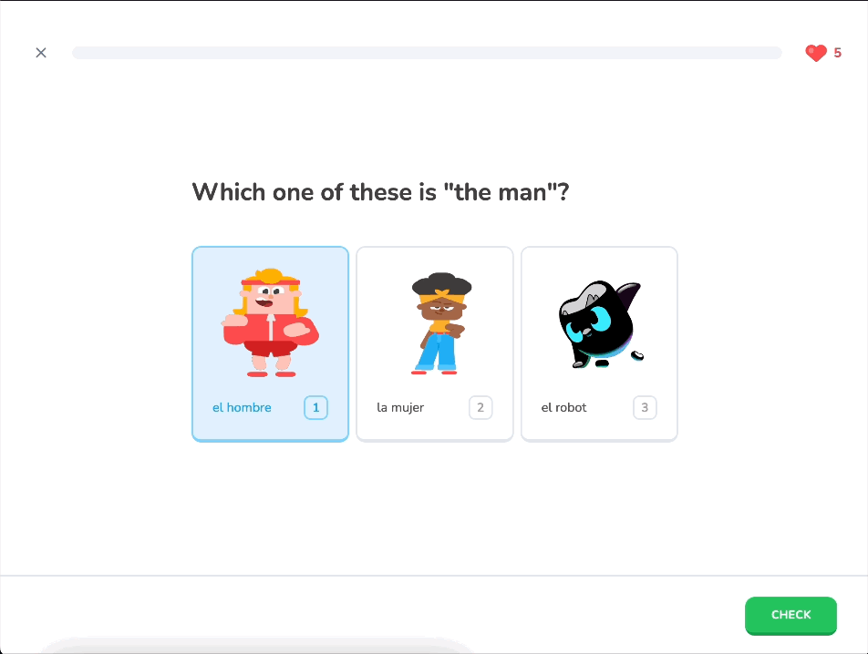
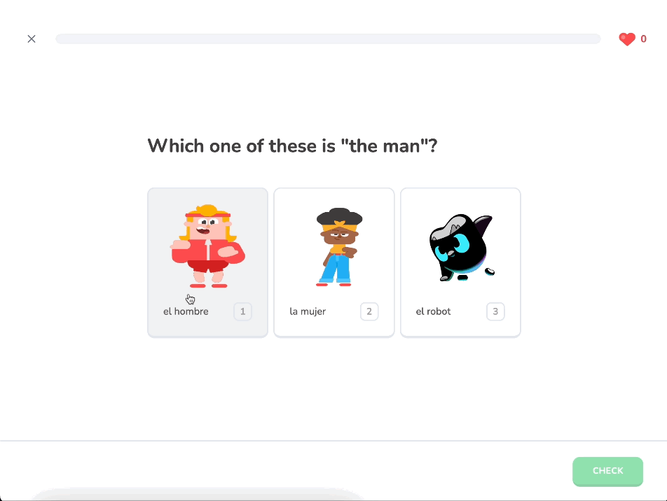

# 23 Hearts Modal

To set up the practice screen, the first step involves creating a modal that triggers when the user runs out of hearts. For testing, we seed the database, select the Spanish course, and attempt the first lesson, deliberately losing all hearts until the user can no longer continue. Once the user reaches 0 hearts, they remain in the challenge. However, attempting to select the "Check" option results in no action. This behavior is correct, as the user should not be able to proceed with the lesson after losing all their hearts.

<div align="center">

</div>
Here is a generated Table of Contents based on your current README structure:


## Table of Contents

- [Setting up the Hearts Modal](#setting-up-the-hearts-modal)
    - [Step 1: Configuring the Hearts Modal State](#step-1-configuring-the-hearts-modal-state)
    - [Step 2: Building the Hearts Modal Component](#step-2-building-the-hearts-modal-component)
- [Implementing the Hearts Modal](#implementing-the-hearts-modal)
    - [Integrating into the App Layout](#integrating-into-the-app-layout)
    - [Incorporating into the Quiz Component](#incorporating-into-the-quiz-component)


## Setting up the Hearts Modal

### Step 1: Configuring the Hearts Modal State

First, navigate to the `lingo/store/` directory and duplicate the `use-exit-modal.ts` file, renaming it **`use-hearts-modal.ts`**. Update the code to refer to the hearts modal instead of the exit modal:

#### `store/use-hearts-modal.ts`
```ts
import { create } from "zustand";

type HeartsModalState = {
    isOpen: boolean;
    open: () => void;
    close: () => void;
}

export const useHeartsModal = create<HeartsModalState>((set) => ({
    isOpen: false,
    open: () => set({ isOpen: true }),
    close: () => set({ isOpen: false }),
}));
```

### Step 2: Building the Hearts Modal Component

Next, go to the `components/modals/` directory and duplicate the `exit-modal.tsx` file, renaming it **`hearts-modal.tsx`**. Update the code to import the new `useHeartsModal`, and replace the `<Image/>` source from "/mascot_sad" to "/mascot_bad":

#### `components/modals/hearts-modal.tsx`

```tsx
"use client"

import Image from "next/image";
import { useRouter } from "next/navigation";
import { useEffect, useState } from "react";

import {
    Dialog,
    DialogContent,
    DialogDescription,
    DialogFooter,
    DialogHeader,
    DialogTitle,
} from "@/components/ui/dialog";
import { Button } from "@/components/ui/button";
import { useHeartsModal } from "@/store/use-hearts-modal";

export const HeartsModal = () => {
    
    const router = useRouter();
    const [ isClient, setIsClient ] = useState(false);
    const { isOpen, close } = useHeartsModal();
    
    useEffect(() => setIsClient(true), []);
    
    const onClick = () => {
        close();
        router.push("/store");
    }
    
    if (!isClient) {
        return null;
    }
    
    return (
        <Dialog open={isOpen} onOpenChange={close}>
            <DialogContent className="max-w-md">
                <DialogHeader>
                    <div className="flex items-center w-full justify-center mb-5">
                        <Image
                            src="/mascot_bad.svg"
                            alt="Mascot"
                            height={80}
                            width={80}
                        />
                    </div>
                    <DialogTitle className="text-center font-bold text-2xl">
                        You ran out of hearts!
                    </DialogTitle>
                    <DialogDescription className="text-center text-base">
                        Get Pro for unlimited hearts, or purchase them in the store.
                    </DialogDescription>
                </DialogHeader>
                <DialogFooter className="mb-4">
                    <div className="flex flex-col gap-y-4 w-full">
                        <Button
                            variant="primary"
                            className="w-full"
                            size="lg" 
                            onClick={onClick}
                        >
                            Get unlimited hearts
                        </Button>
                        <Button
                            variant="primaryOutline"
                            className="w-full"
                            size="lg" 
                            onClick={close}
                        >
                            No thanks
                        </Button>
                    </div>
                </DialogFooter>
            </DialogContent>
        </Dialog>
    );
};
```

The changes made to the `exit-modal.tsx` include:

- Importing `useHeartsModal`.
- Replacing the mascot image.
- Updating the Dialogue Title and Description.
- Adjusting the `<Button>` functionality to either exit the lesson or navigate to the "/store" page.

## Implementing the Hearts Modal

### Integrating into the App Layout

You can now import the **Hearts Modal** into the app's page layout, placing the component just below the `<ExitModal />`:

#### `app/layout.tsx`
```tsx
import { HeartsModal } from "@/components/modals/hearts-modal"; // NEW IMPORT

// code omitted for brevity
export default function RootLayout({
  children,
}: Readonly<{
  children: React.ReactNode;
}>) {
  return (
    <ClerkProvider>
      <html lang="en">
        <body className={font.className}>
          <Toaster />
          <ExitModal />
          <HeartsModal />
          {children}
        </body>
      </html>
    </ClerkProvider>
  );
}
```

### Incorporating into the Quiz Component

In the Quiz Component, destructure `{ open }` from `useHeartsModal`, renaming it `openHeartsModal`:

#### `lesson/quiz.tsx`
```tsx
import { useHeartsModal } from "@/store/use-hearts-modal";
// ...code omitted for brevity

const Quiz = ({}:Props) => {
    const { open: openHeartsModal } = useHeartsModal();
    
    // ...
}
```

To trigger the `openHeartsModal`, incorporate it into the `catch{}` statement within the `onContinue` method whenever the "Missing hearts" error occurs:

```tsx
const Quiz = ({}:Props) => {
    const { open: openHeartsModal } = useHeartsModal();
    // ...
    const onContinue = () => {
        // ...
        if (correctOption && correctOption.id === selectedOption) {
            startTransition(() => {
                upsertChallengeProgress(challenge.id)
                    .then((response) => {
                        if (response?.error === "hearts") {
                            // console.error("Missing hearts");
                            openHeartsModal();
                            return;
                        })
                // ...
            })
    } else {
        // ...
        startTransition(() => {
                reduceHearts(challenge.id)
                    .then((response) => {
                        if (response?.error === "hearts") {
                            // console.error("Missing Hearts");
                            openHeartsModal();
                            return;
                        }})
            // ...
        })
    }
}
```

After testing, a modal similar to the exit modal should appear when attempting to continue with zero hearts.

<div align="center">

</div>

Finally, reseed the database to reset the hearts and progress to prepare practice screen — the focus of the next section.
