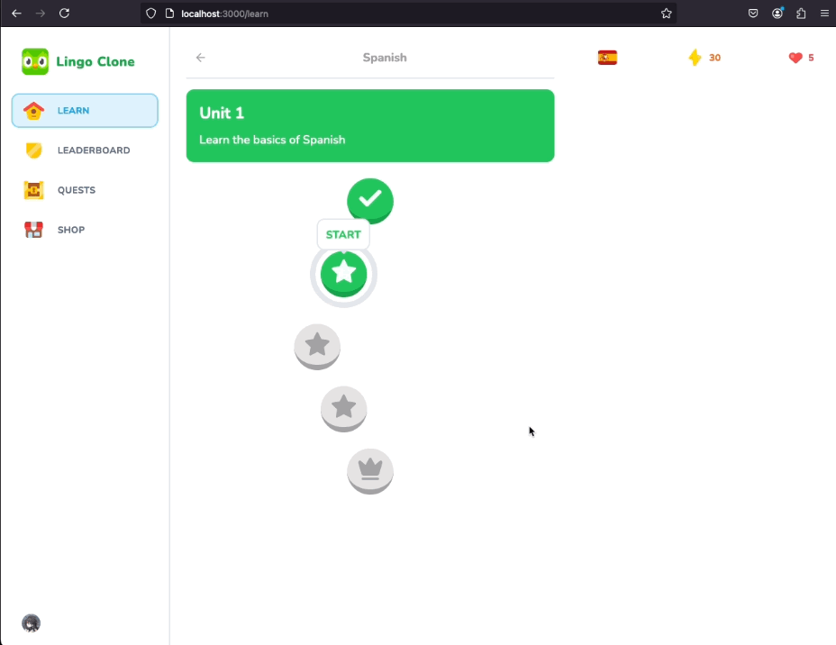

# 24 Practice Screen

To allow users to access a practice lesson, we need to modify the application to navigate to a specific URL containing the `lessonId`. This section describes how to implement a new route and modal for practice lessons, letting users regain hearts and earn additional points.

## Table of Contents
- [Setting up the Practice Screen](#setting-up-the-practice-screen)
- [Creating a Practice Modal](#creating-a-practice-modal)
- [Adding to the App's Layout](#adding-to-the-apps-layout)
- [Modifying the Quiz Component](#modifying-the-quiz-component)
- [Regaining Hearts](#regaining-hearts)
- [Upcoming Feature](#upcoming-feature)


## Setting up the Practice Screen

We begin by creating a new route directory within the `lesson/` folder, named **`[lessonId]/`**. Next, we duplicate the `page.tsx` from the main `lesson/` directory and modify it as follows:

#### `lesson/[lessonId]/page.tsx`
```tsx
import { redirect } from "next/navigation";
import { getLesson, getUserProgress } from "@/db/queries";
import { Quiz } from "../quiz";

type Props  = {
    params: {
        lessonId: number;
    }
}

const LessonIdPage = async ({
    params,
}: Props) => {
    const lessonData = getLesson(params.lessonId);
    const userProgressData = getUserProgress();
    
    const [
        lesson,
        userProgress,
    ] = await Promise.all([
        lessonData,
        userProgressData,
    ]);
    
    if (!lesson || !userProgress) {
        redirect("/learn");
    }
    
    const initialPercentage = lesson.challenges
        .filter((challenge) => challenge.completed)
        .length / lesson.challenges.length * 100;
    
    return (
        <Quiz
            initialLessonId={lesson.id}
            initialLessonChallenges={lesson.challenges}
            initialHearts={userProgress.hearts}
            initialPercentage={initialPercentage}
            userSubscription={null}
        />
    );
};

export default LessonIdPage;
```
- We fix the import path by adding an additional `.` to correctly retrieve the Quiz Component.
- `Props` are added to pass the `lessonId` parameter, and the exported asynchronous component is renamed to `LessonIdPage`.
- The `getLesson()` query method is used to retrieve the lesson data associated with the `lessonId`.

Once this setup is complete, users can click on completed lessons to access them for practice.

## Creating a Practice Modal

To signify that the user is in a practice lesson, we'll create a practice modal. Here's how we proceed:

1. Duplicate the `use-hearts-modal.ts` file in the `store/` directory and rename it to **`use-practice-modal.ts`**.
2. Rename the state and constants accordingly:

#### `use-practice-modal.ts`
```ts
import { create } from "zustand";

type PracticeModalState = {
    isOpen: boolean;
    open: () => void;
    close: () => void;
}

export const usePracticeModal = create<PracticeModalState>((set) => ({
    isOpen: false,
    open: () => set({ isOpen: true }),
    close: () => set({ isOpen: false }),
}));
```

Next, in the `components/modals/` directory, duplicate the `hearts-modal.tsx` component and rename it **`practice-modal.tsx`**. Update any references to the hearts modal and make the following changes:

#### `practice-modal.tsx`
```tsx
"use client"

import Image from "next/image";
import { useEffect, useState } from "react";

import {
    Dialog,
    DialogContent,
    DialogDescription,
    DialogFooter,
    DialogHeader,
    DialogTitle,
} from "@/components/ui/dialog";
import { Button } from "@/components/ui/button";
import { usePracticeModal } from "@/store/use-practice-modal";

export const PracticeModal = () => {
    const [isClient, setIsClient] = useState(false);
    const { isOpen, close } = usePracticeModal();
    
    useEffect(() => setIsClient(true), []);
    
    if (!isClient) {
        return null;
    }
    
    return (
        <Dialog open={isOpen} onOpenChange={close}>
            <DialogContent className="max-w-md">
                <DialogHeader>
                    <div className="flex items-center w-full justify-center mb-5">
                        <Image
                            src="/heart.svg"
                            alt="Heart"
                            height={100}
                            width={100}
                        />
                    </div>
                    <DialogTitle className="text-center font-bold text-2xl">
                        Practice Lesson
                    </DialogTitle>
                    <DialogDescription className="text-center text-base">
                        Use practice lessons to regain hearts and points. You cannot lose hearts or points in practice lessons.
                    </DialogDescription>
                </DialogHeader>
                <DialogFooter className="mb-4">
                    <div className="flex flex-col gap-y-4 w-full">
                        <Button
                            variant="primary"
                            className="w-full"
                            size="lg" 
                            onClick={close}
                        >
                            I understand
                        </Button>
                    </div>
                </DialogFooter>
            </DialogContent>
        </Dialog>
    );
};
```
- Remove unnecessary `onClick` logic.
- Change the image source to `heart.svg` and adjust the dimensions to `100x100`.
- Update the dialog components to inform the user that they're in a practice lesson, simplify the button functionality, and remove extra buttons.
- Remove `useRouter()` since it's unnecessary.

## Adding to the App's Layout

Now, we need to add the Practice Modal to the app's layout file:

#### `app/layout.tsx`
```tsx
import { PracticeModal } from "@/components/modals/practice-modal";

export default function RootLayout({
  children,
}: Readonly<{
  children: React.ReactNode;
}>) {
  return (
    <ClerkProvider>
      <html lang="en">
        <body className={font.className}>
          <Toaster />
          <ExitModal />
          <HeartsModal />
          <PracticeModal />
          {children}
        </body>
      </html>
    </ClerkProvider>
  );
}
```

## Modifying the Quiz Component

In the quiz component, import the `useMount` hook from `react-use`, which simplifies handling the mounting of components compared to `useEffect`. Add `openPracticeModal` from `usePracticeModal()` within the component logic and use it to prompt the modal when a user accesses a practice lesson.

#### `lesson/quiz.tsx`
```tsx
import { usePracticeModal } from "@/store/use-practice-modal";

export const Quiz = ({/*...*/}: Props) => {
    const { open: openPracticeModal } = usePracticeModal();
    
    useMount(() => {
        if (initialPercentage === 100) {
            openPracticeModal();
        }
    });
}
```


<div align="center">

</div>

The modal now notifies users when they enter a practice lesson. However, the progress bar initially reflects the lesson's completion, so it must be reset. Here's how to handle that:

```tsx
const [percentage, setPercentage] = useState(() => {
    return initialPercentage === 100 ? 0 : initialPercentage;
});
```

By setting the progress bar to `0`, users can feel like they are progressing through the lesson again, even if it has already been completed. In a practice lesson, users won't lose hearts or points for incorrect answers.

<div align="center">

</div>

## Regaining Hearts

Finally, testing the feature confirms that users can regain hearts during practice lessons. To verify, reset the database and test both regular and practice lessons to see if hearts are restored.

<div align="center">

</div>

The app successfully prevents hearts from exceeding the maximum limit of 5, ensuring smooth gameplay.

## Upcoming Feature

The next section will focus on creating a Shop and Subscription page, allowing users to exchange points for hearts or subscribe via Stripe.