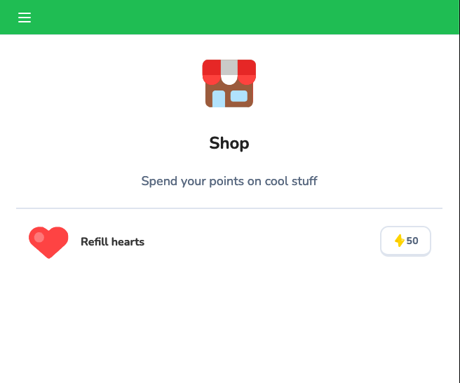
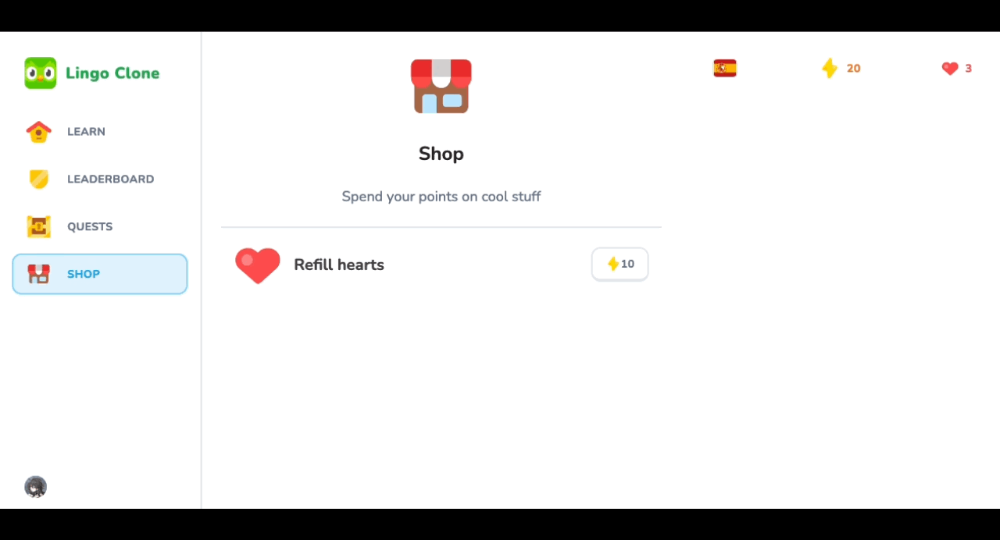

# 25 Shop

This section implements a shop where users can spend their points to refill their hearts, enabling them to continue their lessons without limits. Users can only refill their hearts if they have fewer than five hearts and enough points, otherwise, the option will be disabled. This feature enhances the user experience by adding gamification elements and giving users more control over their learning progression.

## Table of Contents
- [Setting up the Shop Page](#setting-up-the-shop-page)
- [Setting up the `<FeedWrapper>`](#setting-up-the-feedwrapper)
- [Adding Logic to Refill Hearts](#adding-logic-to-refill-hearts)
- [Creating the Refill Hearts Method](#creating-the-refill-hearts-method)
- [Upcoming Section](#upcoming-section)

## Setting up the Shop Page

Currently, when users click the link to access the shop, they encounter a 404 error because the page doesn't exist. To resolve this, a new route directory called **`shop/`** was created inside the `app/(main)/` directory with a simple `page.tsx` file to render the shop page.

#### `app/(main)/shop/page.tsx`

```tsx
const ShopPage = () => {
    return (
        <div>
            Shop Page
        </div>
    );
};

export default ShopPage;
```

This page was further styled and modified to include the reusable components `<StickyWrapper>` and `<UserProgress />`, as used in the Learn Page. Since we need to load user progress, the component was converted into an async method that queries the `userProgressData`, and if no user progress is found, the user is redirected to the "/courses" page.

```tsx
import { getUserProgress } from "@/db/queries";
import { UserProgress } from "@/components/user-progress";
import { StickyWrapper } from "@/components/sticky-wrapper";

const ShopPage = async () => {
    const userProgressData = getUserProgress();
    
    const [userProgress] = await Promise.all([userProgressData]);
    
    if (!userProgress || !userProgress.activeCourse) {
        redirect("/courses");
    }
    
    return (
        <div className="flex flex-row-reverse gap-[48px] px-6">
            <StickyWrapper>
                <UserProgress /*...*/ />
            </StickyWrapper>
        </div>
    );
};

export default ShopPage;
```


## Setting up the `<FeedWrapper>`

The next step was importing the `<FeedWrapper>` as a reusable component and loading an `<Image />` SVG to describe the shop. Additionally, a new component called `<Items />` was created within the `shop/` route directory to handle the shop’s functionality. The initial setup for the component was minimal:

#### `shop/items.tsx`

```tsx
"use client";

type Props = {
    hearts: number;
    points: number;
    hasActiveSubscription: boolean;
};

export const Items = ({
    hearts,
    points,
    hasActiveSubscription,
}: Props) => {
    return (
        <div>
            Items
        </div>
    );
};
```

This component was then imported into the Shop Page, allowing users to access the shop by clicking on the points displayed on the Learn Page. Logic was added so users could refill their hearts, but only if they had fewer than five hearts and enough points. The button will be disabled if hearts are full or if there are insufficient points.

<div align="center">

</div>


## Adding Logic to Refill Hearts

A function using `useTransition()` was created alongside an `onClick` constant, `onRefillHearts`. An if-clause checks whether the action is pending, hearts are full, or points are insufficient. If so, no action is taken, but otherwise, the `startTransition()` is activated to handle the refill.

#### `shop/items.tsx`

```tsx
import { useTransition } from "react";

export const POINTS_TO_REFILL = 10;

export const Items = ({/*...*/}: Props) => {
    const [pending, startTransition] = useTransition();
    
    const onRefillHearts = () => {
        if (pending || hearts === 5 || points < POINTS_TO_REFILL) {
            return;
        }
        startTransition(() => {});
    };

    return (
        <Button
            onClick={onRefillHearts}
            disabled={pending || hearts === 5 || points < POINTS_TO_REFILL}
        >
            {hearts === 5
                ? "Full"
                : (
                    <div className="flex items-center">
                        <Image
                            src="/points.svg"
                            alt="Points"
                            height={20}
                            width={20}
                        />
                        <p>{POINTS_TO_REFILL}</p>
                    </div>
                )
            }
        </Button>
    );
};
```


## Creating the Refill Hearts Method

A new method was added to the `user-progress.ts` server action file to handle refilling hearts. This method validates that the user has enough points and hearts available before updating the database and revalidating the relevant paths.

#### `actions/user-progress.ts`

```ts
const POINTS_TO_REFILL = 10;

export const refillHearts = async () => {
    const currentUserProgress = await getUserProgress();
    
    if (!currentUserProgress) {
        throw new Error("User progress not found");
    }
    
    if (currentUserProgress.hearts === 5) {
        throw new Error("Hearts are already full");
    }
    
    if (currentUserProgress.points < POINTS_TO_REFILL) {
        throw new Error("Not enough points");
    }
    
    await db.update(userProgress).set({
        hearts: 5,
        points: currentUserProgress.points - POINTS_TO_REFILL,
    }).where(eq(userProgress.userId, currentUserProgress.userId));
    
    revalidatePath("/shop");
    revalidatePath("/learn");
    revalidatePath("/quests");
    revalidatePath("/leaderboard");
};
```

The `refillHearts()` method was then integrated into the Items component’s `startTransition()` function, with a `.catch()` to handle any potential errors.

<div align="center">

</div>

The method is now fully functional, allowing users to refill their hearts by spending points.


## Upcoming Section

The next section will focus on implementing a Stripe subscription to allow users to subscribe for additional benefits.
